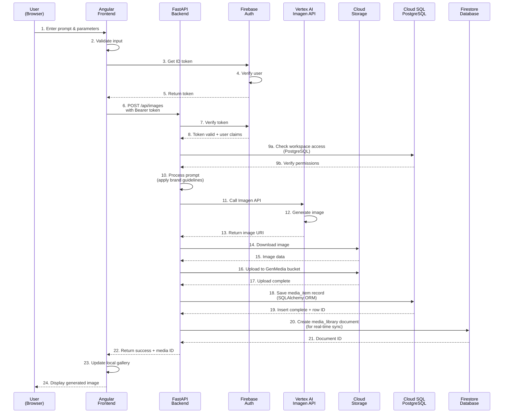
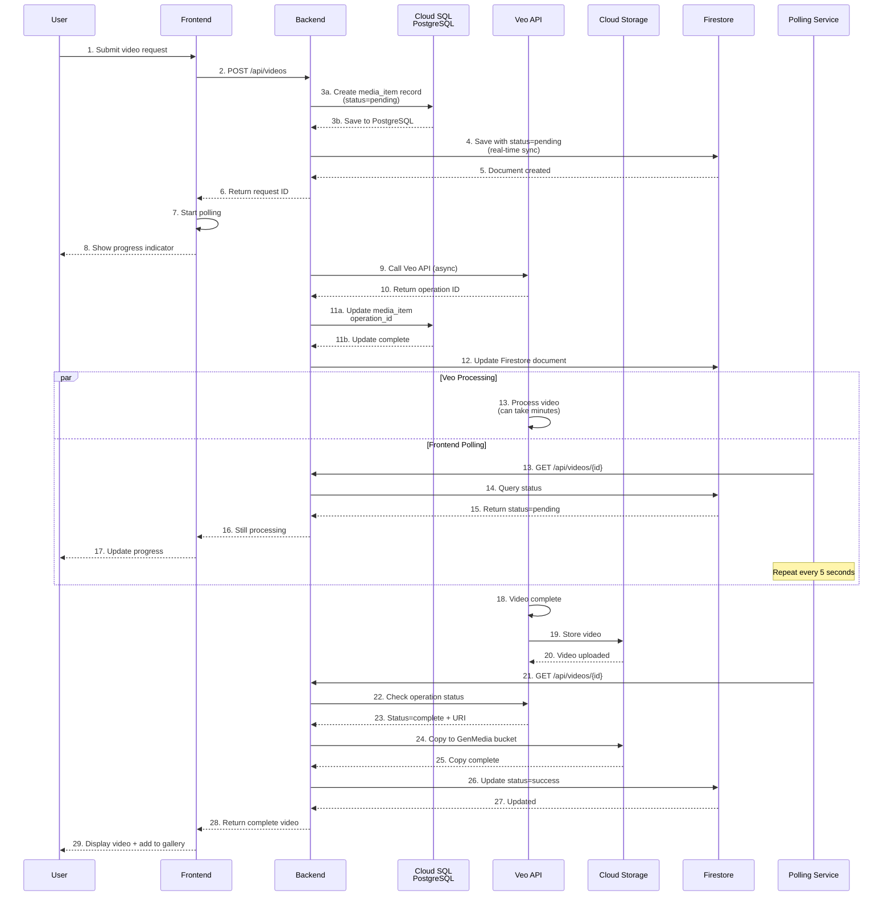
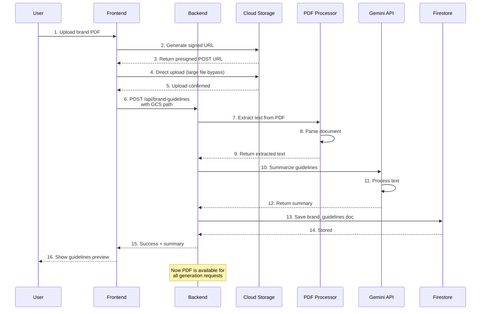
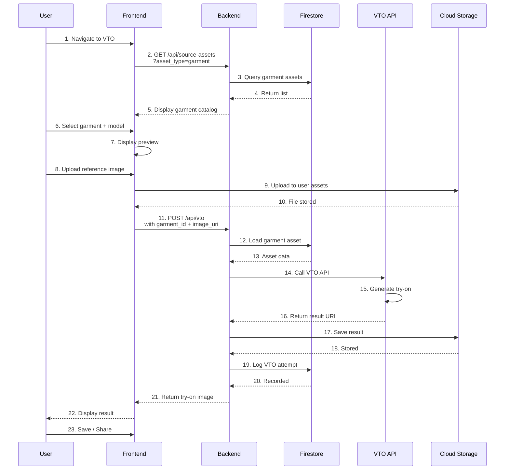
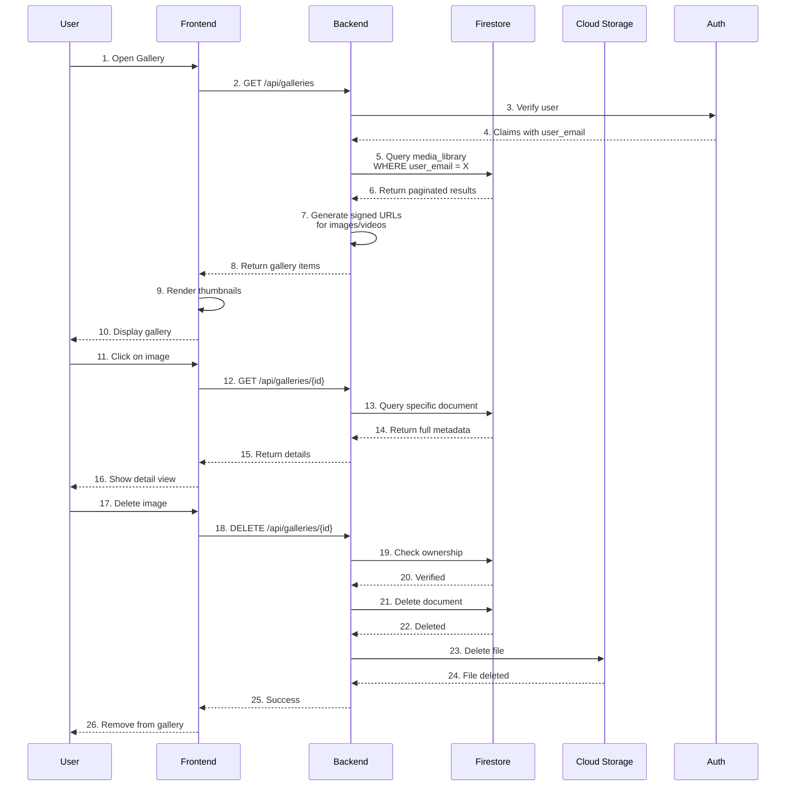
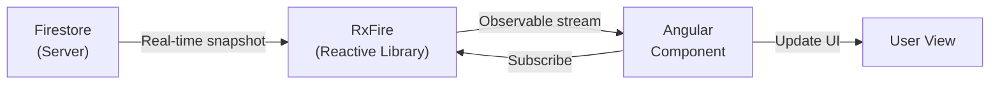
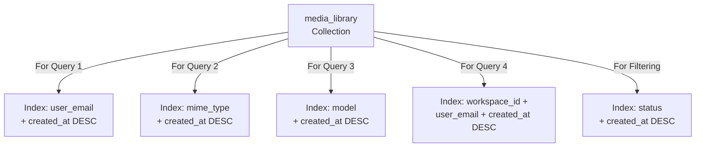
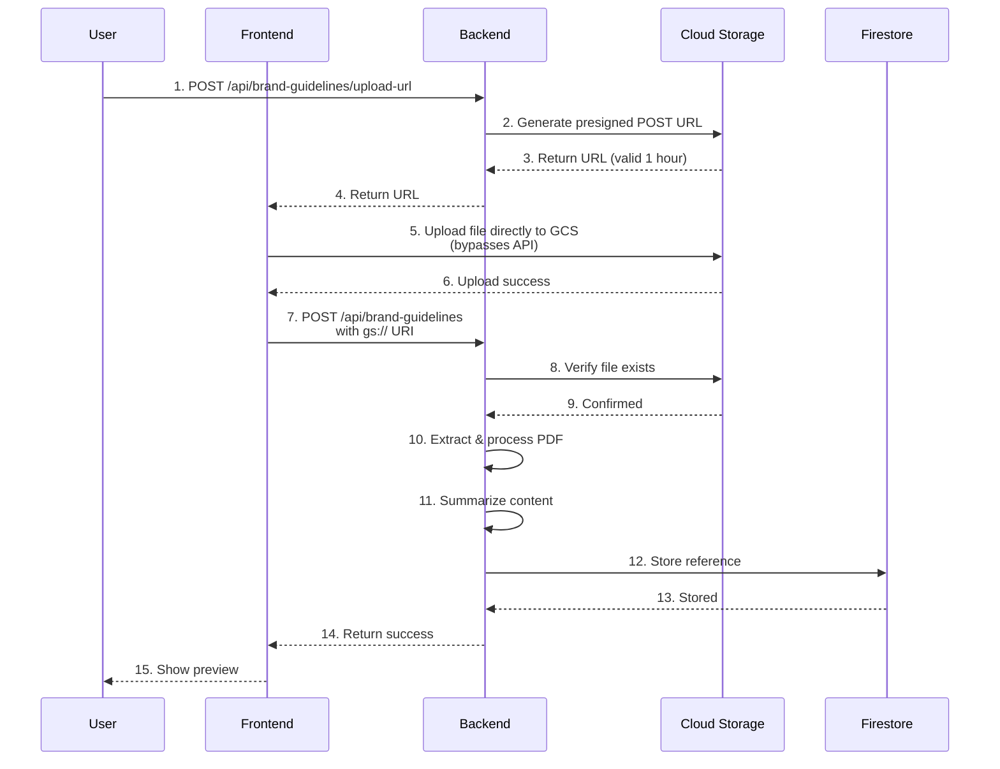
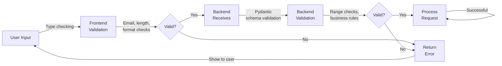

# Data Flow & Component Interactions

## Overview

This document details how data flows through the Creative Studio application, from user interactions through the frontend, to the backend, and into external services.

---

## End-to-End User Journey

### Image Generation Flow



**Key Addition**: Step 9a-9b and 18-19 show PostgreSQL integration via SQLAlchemy ORM for:
- Workspace and permission verification (strong consistency)
- Media item history storage (structured relational data)
- User audit trails and generation statistics

### Video Generation Flow (Async)



### Brand Guidelines Processing



### Virtual Try-On (VTO) Flow



### Gallery Management Flow



---

## Real-Time Data Synchronization

### Firebase Real-Time Listener



**RxFire Responsibilities**:
- Handles subscriptions
- Unsubscribe cleanup
- Error handling

### Implementation Example

```typescript
// In Angular component
import { AngularFirestore } from '@angular/fire/firestore';
import { Observable } from 'rxjs';

export class GalleryComponent {
  gallery$: Observable<any[]>;

  constructor(private afs: AngularFirestore) {
    // Subscribe to real-time updates
    this.gallery$ = this.afs
      .collection('media_library', ref =>
        ref
          .where('user_email', '==', this.userEmail)
          .orderBy('created_at', 'desc')
          .limit(20)
      )
      .valueChanges({ idField: 'id' });
  }
}

// In template
<div *ngFor="let item of gallery$ | async">
  {{ item.prompt }}
</div>
```

---

## API Request/Response Patterns

### Standard API Response Structure

```json
{
  "success": true,
  "data": {
    "id": "doc-12345",
    "model": "imagen-3-fast",
    "status": "success",
    "created_at": "2025-01-15T10:30:00Z",
    "gcs_uri": "gs://bucket/media/image-12345.png"
  },
  "message": "Image generated successfully"
}
```

### Error Response Structure

```json
{
  "success": false,
  "error": {
    "code": "INVALID_INPUT",
    "message": "Prompt exceeds maximum length of 1000 characters"
  },
  "timestamp": "2025-01-15T10:30:00Z"
}
```

### Request with Authentication

```typescript
// Angular HTTP Client
import { HttpClient, HttpHeaders } from '@angular/common/http';

this.http.post('/api/images', {
  prompt: "A beautiful landscape",
  style: "photorealistic"
}, {
  headers: new HttpHeaders({
    'Authorization': `Bearer ${idToken}`,
    'Content-Type': 'application/json'
  })
}).subscribe(response => {
  console.log(response);
});

// Alternatively, use interceptor to attach token automatically
```

---

## Database Query Patterns

### Media Library Queries

```sql
-- Query 1: Get all user's media (paginated)
SELECT * FROM media_library
WHERE user_email = 'user@example.com'
ORDER BY created_at DESC
LIMIT 20

-- Query 2: Get media by type
SELECT * FROM media_library
WHERE user_email = 'user@example.com'
AND mime_type = 'image/png'
ORDER BY created_at DESC

-- Query 3: Get media by model
SELECT * FROM media_library
WHERE user_email = 'user@example.com'
AND model = 'imagen-3-fast'
ORDER BY created_at DESC

-- Query 4: Get media by workspace
SELECT * FROM media_library
WHERE workspace_id = 'workspace-123'
AND user_email = 'user@example.com'
ORDER BY created_at DESC
LIMIT 50
```

### PostgreSQL Query Patterns (SQLAlchemy ORM)

#### User & Workspace Queries

```python
# Get user by email (workspace access verification)
from src.users.user_model import User
from sqlalchemy import select

async with AsyncSessionLocal() as session:
    result = await session.execute(
        select(User).where(User.email == "user@example.com")
    )
    user = result.scalar_one_or_none()

# Get workspace members with roles
from src.workspaces.schema.workspace_model import WorkspaceMember

async with AsyncSessionLocal() as session:
    result = await session.execute(
        select(WorkspaceMember)
        .join(User)
        .where(WorkspaceMember.workspace_id == workspace_id)
        .order_by(User.email)
    )
    members = result.scalars().all()
```

#### Media Items Queries

```python
# Get media items by workspace (generation history)
from src.common.schema.media_item_model import MediaItem
from sqlalchemy import desc

async with AsyncSessionLocal() as session:
    result = await session.execute(
        select(MediaItem)
        .where(MediaItem.workspace_id == workspace_id)
        .order_by(desc(MediaItem.created_at))
        .limit(50)
    )
    items = result.scalars().all()

# Get media by model and status
async with AsyncSessionLocal() as session:
    result = await session.execute(
        select(MediaItem)
        .where(
            (MediaItem.workspace_id == workspace_id) &
            (MediaItem.model == "imagen-3-fast") &
            (MediaItem.status == "success")
        )
        .order_by(desc(MediaItem.created_at))
    )
    images = result.scalars().all()

# Get generation statistics
from sqlalchemy import func

async with AsyncSessionLocal() as session:
    result = await session.execute(
        select(
            MediaItem.model,
            func.count(MediaItem.id).label("count"),
            func.avg(MediaItem.generation_time).label("avg_time")
        )
        .where(MediaItem.workspace_id == workspace_id)
        .group_by(MediaItem.model)
    )
    stats = result.all()
```

#### Template & Asset Queries

```python
# Get media templates for workspace
from src.media_templates.schema.media_template_model import MediaTemplate

async with AsyncSessionLocal() as session:
    result = await session.execute(
        select(MediaTemplate)
        .filter_by(mime_type="image/png")  # or video/mp4, audio/mp3
        .order_by(desc(MediaTemplate.created_at))
    )
    templates = result.scalars().all()

# Get source assets by type
from src.source_assets.schema.source_asset_model import SourceAsset

async with AsyncSessionLocal() as session:
    result = await session.execute(
        select(SourceAsset)
        .where(
            (SourceAsset.workspace_id == workspace_id) &
            (SourceAsset.asset_type == "image")
        )
        .order_by(desc(SourceAsset.created_at))
    )
    assets = result.scalars().all()
```

#### Index Recommendations

```sql
-- Performance indexes for common queries
CREATE INDEX idx_media_items_workspace_created
    ON media_items(workspace_id, created_at DESC);

CREATE INDEX idx_media_items_status_model
    ON media_items(workspace_id, status, model);

CREATE INDEX idx_source_assets_workspace_type
    ON source_assets(workspace_id, asset_type, created_at DESC);

CREATE INDEX idx_workspace_members_workspace
    ON workspace_members(workspace_id);

CREATE INDEX idx_users_email
    ON users(email) UNIQUE;
```

### Firestore Collection Indexes



---

## File Upload/Download Flow

### Large File Upload (PDF Brand Guidelines)



### Media Download Flow

```mermaid
graph LR
    User["User Browser"]
    FE["Angular<br/>Frontend"]
    API["Backend<br/>API"]
    GCS["Cloud Storage"]
    CDN["Firebase CDN"]

    User -->|1. Click download| FE
    FE -->|2. Request download<br/>URL| API
    API -->|3. Generate<br/>signed URL<br/>(1 hour valid)| GCS
    GCS -->|4. Return URL| API
    API -->|5. Return to FE| FE
    FE -->|6. Redirect to<br/>signed URL| CDN
    CDN -->|7. Stream file| User
```

**Security Note**: Signed URL expires after 1 hour for security.

---

## Search & Filter Implementation

### Gallery Search Query

```typescript
// Frontend component
filterGallery(filters: {
  mime_type?: string;
  model?: string;
  status?: string;
  dateRange?: [Date, Date];
}) {
  let query = this.afs
    .collection('media_library', ref => {
      let q = ref
        .where('user_email', '==', this.userEmail)
        .orderBy('created_at', 'desc');

      // Add filters
      if (filters.mime_type) {
        q = q.where('mime_type', '==', filters.mime_type);
      }
      if (filters.model) {
        q = q.where('model', '==', filters.model);
      }
      if (filters.status) {
        q = q.where('status', '==', filters.status);
      }

      return q.limit(50);
    });

  return query.valueChanges();
}
```

### Composite Index Example

For the above multi-filter query, Firestore creates:
```
Collection: media_library
Indexes:
  1. user_email (ASC), created_at (DESC)
  2. user_email (ASC), mime_type (ASC), created_at (DESC)
  3. user_email (ASC), model (ASC), created_at (DESC)
  4. user_email (ASC), status (ASC), created_at (DESC)
  5. user_email (ASC), mime_type (ASC), model (ASC), created_at (DESC)
  ... etc
```

---

## Caching Strategy

### Frontend Caching

```typescript
// Service with caching
@Injectable({ providedIn: 'root' })
export class GalleryService {
  private cache = new Map<string, any>();
  private cacheTTL = 5 * 60 * 1000; // 5 minutes

  getGallery(userId: string) {
    const cached = this.cache.get(userId);

    if (cached && Date.now() - cached.timestamp < this.cacheTTL) {
      return of(cached.data);
    }

    return this.http.get(`/api/galleries/${userId}`).pipe(
      tap(data => {
        this.cache.set(userId, {
          data,
          timestamp: Date.now()
        });
      }),
      shareReplay(1)
    );
  }
}
```

### Backend Response Caching

```python
# FastAPI with caching
from functools import lru_cache
from datetime import datetime, timedelta

@app.get("/api/generation-options")
@cache(expire=3600)  # Cache for 1 hour
async def get_generation_options():
    """
    Generation options are static and don't change
    Safe to cache for extended period
    """
    return {
        "models": ["imagen-3-fast", "imagen-3", "veo-1"],
        "styles": ["photorealistic", "watercolor", "oil-painting"],
        "sizes": ["512x512", "1024x1024", "1024x576"]
    }
```

### CDN Caching (Firebase Hosting)

```json
{
  "hosting": {
    "headers": [
      {
        "source": "/api/**",
        "headers": [
          {
            "key": "Cache-Control",
            "value": "no-cache, no-store"
          }
        ]
      },
      {
        "source": "**/*.{js,css,woff2}",
        "headers": [
          {
            "key": "Cache-Control",
            "value": "public, max-age=31536000"
          }
        ]
      }
    ]
  }
}
```

---

## Error Handling & Retry Logic

### Automatic Retry Pattern

```typescript
// Frontend with exponential backoff
import { retry, timer } from 'rxjs';

this.http.post('/api/videos', videoRequest).pipe(
  retry({
    count: 3,
    delay: (error, retryCount) => {
      const delayMs = Math.pow(2, retryCount) * 1000; // 1s, 2s, 4s
      console.log(`Retry ${retryCount + 1} after ${delayMs}ms`);
      return timer(delayMs);
    }
  })
).subscribe(
  success => console.log('Success'),
  error => console.error('Failed after 3 retries', error)
);
```

### Backend Error Handling

```python
# FastAPI with error recovery
from fastapi import HTTPException

@app.post("/api/images")
async def generate_image(request: ImageRequest):
    try:
        # Call Vertex AI API
        response = await vertex_ai_client.generate_image(request.prompt)
        return {"success": True, "data": response}

    except vertex_ai.PermissionDenied as e:
        logger.error(f"Permission denied: {e}")
        raise HTTPException(status_code=403, detail="Insufficient permissions")

    except vertex_ai.ResourceExhausted as e:
        logger.warning(f"Rate limited: {e}")
        raise HTTPException(status_code=429, detail="Too many requests")

    except vertex_ai.Cancelled as e:
        logger.warning(f"Request cancelled: {e}")
        raise HTTPException(status_code=408, detail="Request timeout")

    except Exception as e:
        logger.error(f"Unexpected error: {e}", exc_info=True)
        raise HTTPException(status_code=500, detail="Internal server error")
```

---

## Performance Optimization

### Query Optimization

```python
# Inefficient: N+1 problem
for user_id in user_ids:
    user = await firestore.get_document(f"users/{user_id}")  # Multiple calls

# Efficient: Batch get
users = await firestore.get_documents([f"users/{uid}" for uid in user_ids])
```

### Pagination Pattern

```typescript
// Frontend pagination
export class GalleryComponent {
  items: any[] = [];
  pageSize = 20;
  lastDoc: any;

  loadMore() {
    this.api.getGallery(
      pageSize: this.pageSize,
      startAfter: this.lastDoc
    ).subscribe(response => {
      this.items = [...this.items, ...response.data];
      this.lastDoc = response.data[response.data.length - 1];
    });
  }
}

// Backend pagination
@app.get("/api/galleries")
async def get_galleries(
    page_size: int = 20,
    start_after: Optional[str] = None
):
    query = firestore.collection('media_library') \
        .where('user_email', '==', user_email) \
        .order_by('created_at', direction=Direction.DESCENDING)

    if start_after:
        last_doc = firestore.get(start_after)
        query = query.start_after(last_doc)

    docs = query.limit(page_size + 1).get()

    return {
        "data": [doc.to_dict() for doc in docs[:page_size]],
        "has_more": len(docs) > page_size
    }
```

---

## Data Validation Flow



---

## Data Consistency & Transactions

### Eventual Consistency Example

```python
# User generates image - transaction
async def generate_image(user_email: str, prompt: str):
    # Step 1: Create media_library document
    doc_ref = firestore.collection('media_library').document()
    doc_ref.set({
        'user_email': user_email,
        'status': 'pending',
        'created_at': datetime.now()
    })

    # Step 2: Call Vertex AI (async)
    try:
        image_uri = await vertex_ai.generate_image(prompt)
    except Exception as e:
        # Step 3: Mark as failed (if error)
        doc_ref.update({'status': 'failed', 'error': str(e)})
        return

    # Step 4: Update with success
    doc_ref.update({
        'status': 'success',
        'gcs_uri': image_uri,
        'completed_at': datetime.now()
    })
```

### Document Structure for Consistency

```json
{
  "media_library": {
    "doc-123": {
      "user_email": "user@example.com",
      "workspace_id": "ws-456",
      "model": "imagen-3-fast",
      "prompt": "Beautiful sunset",
      "status": "success",
      "gcs_uri": "gs://bucket/media/image-123.png",
      "metadata": {
        "width": 1024,
        "height": 1024,
        "seed": 42
      },
      "created_at": "2025-01-15T10:30:00Z",
      "completed_at": "2025-01-15T10:31:45Z"
    }
  }
}
```

---

## Monitoring Data Flow

### Key Metrics

```
Frontend:
  - Page load time
  - API response time
  - Cache hit rate
  - Error rate

Backend:
  - Request latency
  - Firestore operation latency
  - Vertex AI API latency
  - Error rate by endpoint
  - Database query performance

Infrastructure:
  - Cloud Run CPU/Memory usage
  - Firestore read/write operations
  - Cloud Storage operations
  - Network bandwidth
```

### Logging Points

```python
# 1. Request received
logger.info(f"Received {method} {path}")

# 2. Authentication check
logger.info(f"User {user_email} authenticated")

# 3. Database query
logger.info(f"Querying media_library for {user_email}")

# 4. External API call
logger.info(f"Calling Vertex AI Imagen API")

# 5. Response sent
logger.info(f"Returning {status_code} to client")

# 6. Error occurred
logger.error(f"Error in {endpoint}: {error}", exc_info=True)
```

---

## Document Information

- **Last Updated**: December 2025
- **Version**: 1.0
- **Audience**: Full-Stack Developers, Data Engineers
- **License**: Apache License 2.0
