# Component Diagrams & Visual Reference

Quick visual reference guide for all components, their relationships, and interactions in Creative Studio.

---

## System Overview

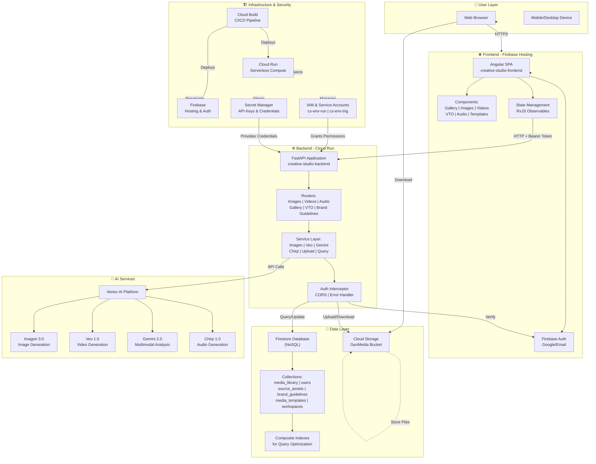

---

## Frontend Architecture

```mermaid
graph LR
    subgraph App["Application Root"]
        AppComp["AppComponent<br/>(app.component.ts)"]
        Router["Angular Router<br/>(app-routing.module.ts)"]
    end

    subgraph Modules["Feature Modules"]
        Gallery["Gallery Module<br/>• media-gallery.component<br/>• media-detail.component<br/>• gallery.service"]
        Images["Images Module<br/>• imagen.component<br/>• imagen.service"]
        Videos["Videos Module<br/>• veo.component<br/>• veo.service"]
        VTO["VTO Module<br/>• vto.component<br/>• vto.service"]
        Audio["Audio Module<br/>• audio.component<br/>• audio.service"]
        Templates["Templates Module<br/>• fun-templates.component<br/>• template.service"]
        Admin["Admin Module<br/>• admin-layout.component<br/>• admin.service"]
    end

    subgraph Services["Shared Services"]
        AuthSvc["AuthService<br/>Firebase Auth"]
        HTTPSvc["HttpClientService<br/>Backend Communication"]
        LoadingSvc["LoadingService<br/>Loading State"]
        ConfigSvc["ConfigService<br/>App Configuration"]
    end

    subgraph Interceptors["HTTP Interceptors"]
        AuthInt["AuthInterceptor<br/>Adds Bearer Token"]
        ErrorInt["ErrorInterceptor<br/>Error Handling"]
    end

    subgraph Utilities["Utilities"]
        Guards["Route Guards<br/>Auth Protection"]
        UtilFuncs["Utility Functions<br/>Formatting, Validation"]
    end

    AppComp --> Router
    Router --> Modules
    Modules -->|Use| Services
    Services -->|Make Requests| HTTPSvc
    HTTPSvc -->|Pass Through| Interceptors
    Backend["FastAPI Backend"]
    Interceptors -->|Enhance Request| Backend

    Utilities -->|Support| Services
```

---

## Backend Architecture

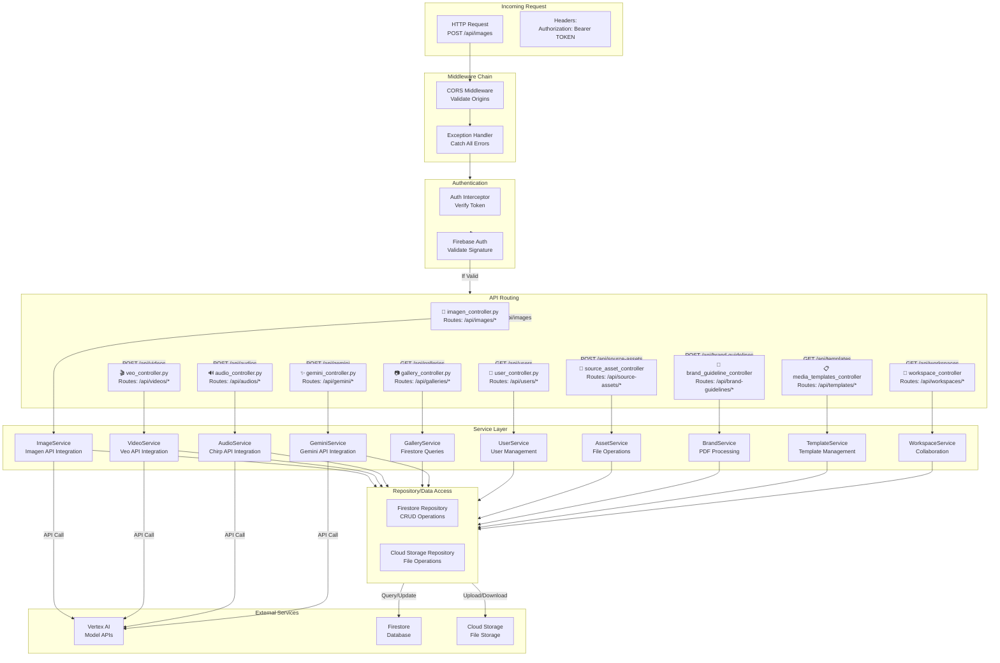

---

## Data Model Relationships

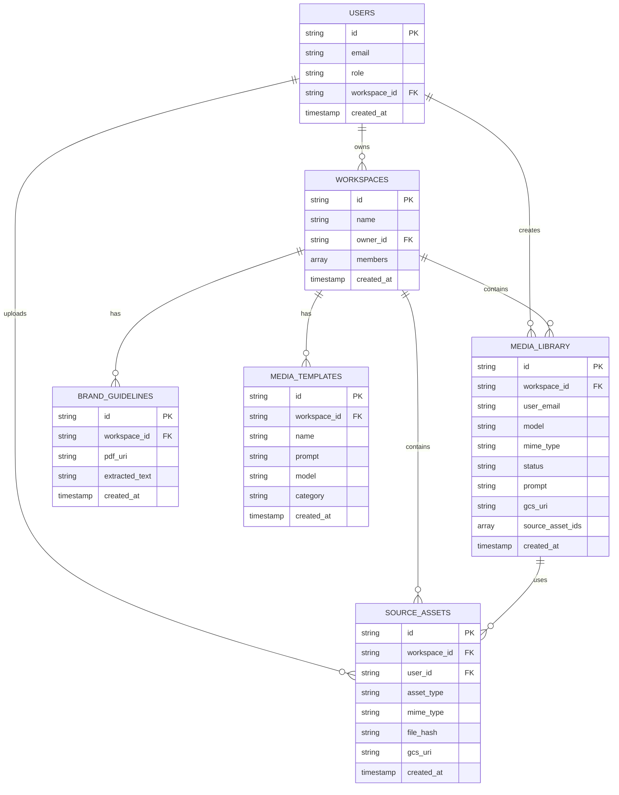

---

## Service Account Permissions Map

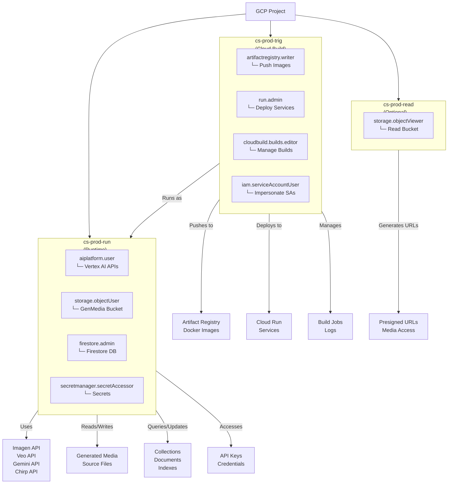

---

## Deployment Pipeline

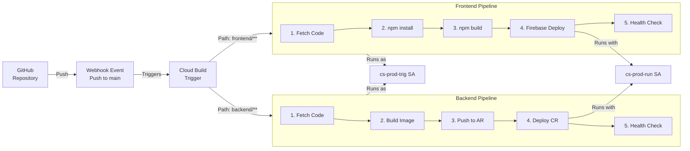

---

## Request/Response Lifecycle

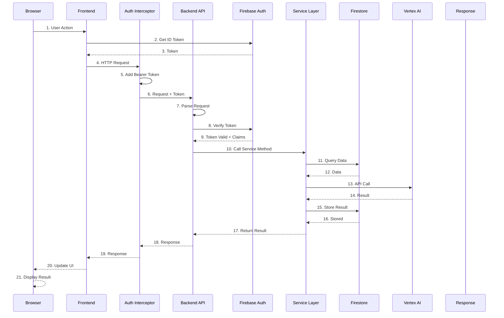

---

## Network Communication Map

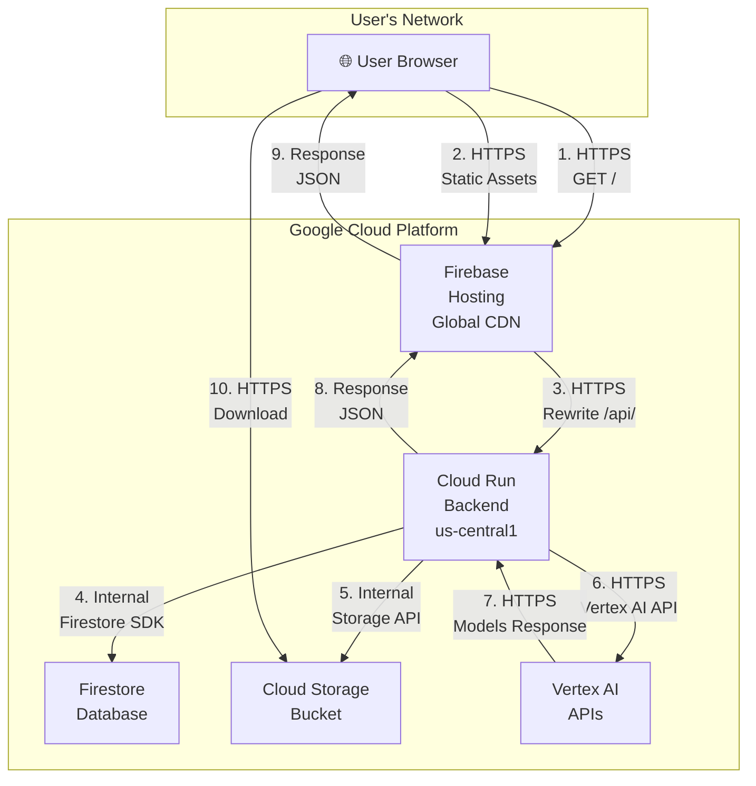

**Note**: All GCP services are isolated in the same VPC/Region for low latency.

---

## Security Boundaries

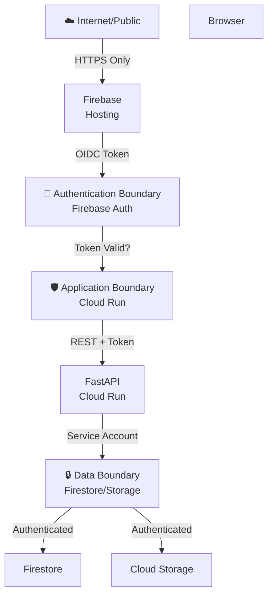

**Security Notes**:
- **Authentication Boundary**: All requests must have valid Firebase token
- **Data Boundary**: Direct access only via authenticated service accounts

---

## Monitoring & Observability

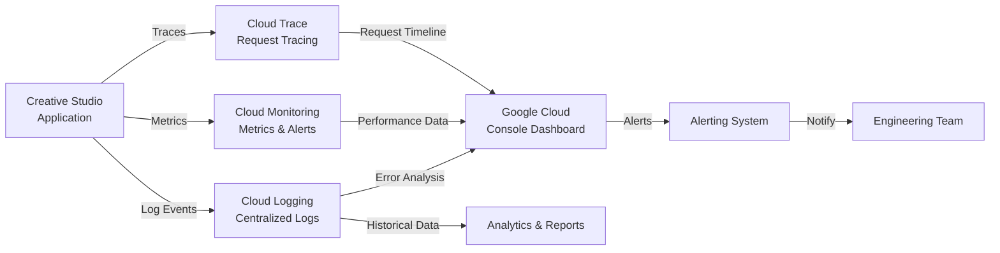

---

## Scaling Architecture

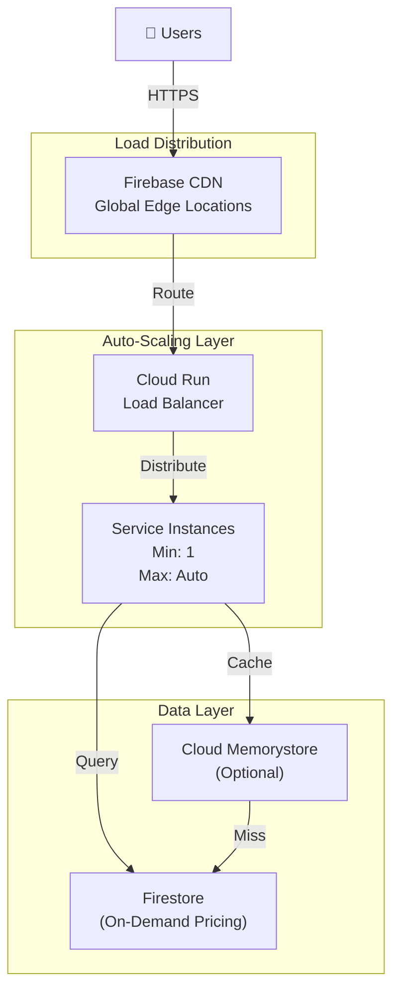

**Scaling Details**:
- **Service Instances**: Scales from 1 to 100s of instances based on traffic
- **Firestore**: Scales automatically based on read/write operations

---

## Disaster Recovery

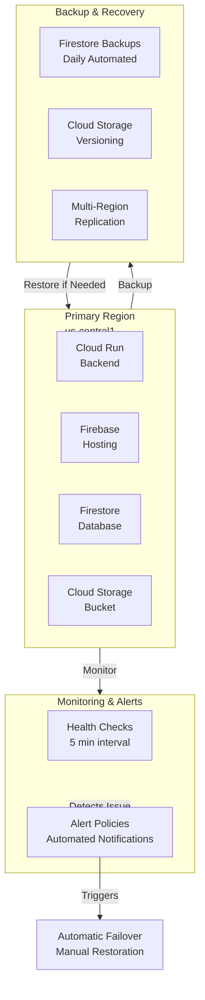

---

## Document Information

- **Last Updated**: December 2025
- **Version**: 1.0
- **Audience**: Architects, System Designers, DevOps
- **License**: Apache License 2.0
