# Creative Studio Architecture

## Overview

Creative Studio is a comprehensive Generative AI platform built on Google Cloud Platform, featuring a modern Angular frontend, FastAPI backend, and full infrastructure-as-code with Terraform. It integrates with Vertex AI for advanced generative capabilities including image generation (Imagen), video generation (Veo), and multimodal analysis with Gemini.

---

## System Architecture Diagram

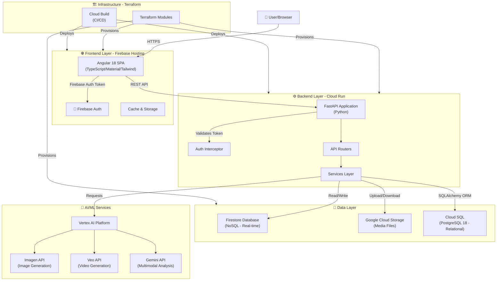

---

## Frontend Architecture

### Technology Stack
- **Framework**: Angular 18
- **Language**: TypeScript
- **Styling**: Tailwind CSS + Angular Material
- **Authentication**: Firebase Authentication
- **Build Tool**: Angular CLI
- **Linting**: GTS (Google TypeScript Style Guide)
- **Package Manager**: npm

### Component Structure

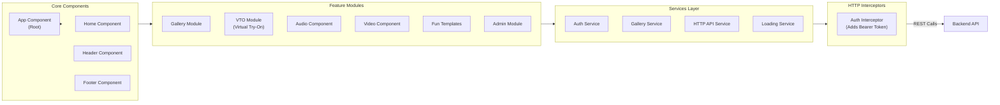

### Key Components

| Component | Purpose |
|-----------|---------|
| **app-root** | Root component with route animations |
| **home** | Landing page and dashboard |
| **gallery** | Media library viewer with metadata |
| **media-detail** | Detailed view of generated media |
| **vto** | Virtual try-on interface |
| **audio** | Audio generation interface |
| **fun-templates** | Predefined prompt templates |
| **admin** | Admin dashboard for configuration |

### Project Structure
```
frontend/
├── src/
│   ├── app/
│   │   ├── admin/              # Admin panel
│   │   ├── arena/              # Workspace/arena interface
│   │   ├── audio/              # Audio generation UI
│   │   ├── common/             # Shared utilities & services
│   │   │   ├── services/       # HTTP, auth, loading services
│   │   │   └── interceptors/   # Auth interceptor
│   │   ├── gallery/            # Media gallery & management
│   │   ├── home/               # Homepage
│   │   ├── login/              # Login/auth page
│   │   ├── services/           # API communication services
│   │   ├── video/              # Video generation UI
│   │   └── vto/                # Virtual try-on module
│   ├── environments/           # Environment configs
│   └── main.ts                 # Bootstrap
├── angular.json                # Angular build config
├── firebase.json               # Firebase config
├── cloudbuild.yaml             # CI/CD pipeline
└── Dockerfile                  # Container image
```

---

## Backend Architecture

### Technology Stack
- **Framework**: FastAPI (Python 3.10+)
- **Server**: Uvicorn
- **Code Style**: Google Python Style Guide + Black + Pylint
- **Package Manager**: uv (with pyproject.toml)

### API Endpoint Structure

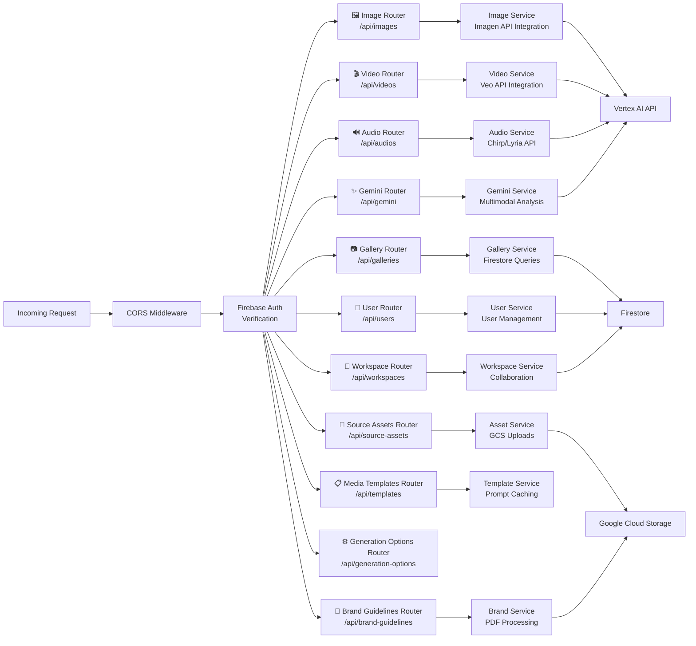

### Backend Project Structure

```
backend/
├── src/
│   ├── audios/                 # Audio generation service
│   │   ├── audio_controller.py
│   │   └── audio_service.py
│   ├── auth/                   # Firebase authentication
│   │   └── firebase_client_service.py
│   ├── brand_guidelines/       # Brand guideline handling
│   │   ├── brand_guideline_controller.py
│   │   ├── brand_guideline_service.py
│   │   ├── dto/
│   │   ├── repository/
│   │   └── schema/
│   ├── galleries/              # Media library management
│   │   ├── gallery_controller.py
│   │   ├── gallery_service.py
│   │   ├── repository/
│   │   └── schema/
│   ├── generation_options/     # Generation parameters
│   │   ├── generation_options_controller.py
│   │   └── dto/
│   ├── images/                 # Imagen integration
│   │   ├── imagen_controller.py
│   │   ├── imagen_service.py
│   │   ├── dto/
│   │   ├── repository/
│   │   └── schema/
│   ├── media_templates/        # Prompt templates
│   │   ├── media_templates_controller.py
│   │   ├── media_templates_service.py
│   │   ├── dto/
│   │   ├── repository/
│   │   └── schema/
│   ├── multimodal/             # Gemini integration
│   │   ├── gemini_controller.py
│   │   └── gemini_service.py
│   ├── source_assets/          # Asset management
│   │   ├── source_asset_controller.py
│   │   ├── source_asset_service.py
│   │   ├── dto/
│   │   ├── repository/
│   │   └── schema/
│   ├── users/                  # User management
│   │   ├── user_controller.py
│   │   ├── user_service.py
│   │   ├── dto/
│   │   ├── repository/
│   │   └── schema/
│   ├── videos/                 # Veo integration
│   │   ├── veo_controller.py
│   │   ├── veo_service.py
│   │   ├── dto/
│   │   └── schema/
│   ├── workspaces/             # Workspace collaboration
│   │   ├── workspace_controller.py
│   │   ├── workspace_service.py
│   │   ├── dto/
│   │   ├── repository/
│   │   └── schema/
│   ├── common/                 # Shared utilities
│   │   ├── database/
│   │   ├── storage/
│   │   └── models/
│   ├── config/                 # Configuration
│   │   ├── config_service.py
│   │   └── logger_config.py
│   └── __init__.py
├── main.py                     # FastAPI app initialization
├── pyproject.toml              # Python dependencies
├── pylintrc                    # Linting config
├── cloudbuild.yaml             # CI/CD pipeline
└── Dockerfile                  # Container image
```

### API Router Overview

| Router | Base Path | Purpose |
|--------|-----------|---------|
| **Imagen** | `/api/images` | Image generation endpoints |
| **Veo** | `/api/videos` | Video generation endpoints |
| **Audio** | `/api/audios` | Audio generation endpoints |
| **Gallery** | `/api/galleries` | Media library operations |
| **Gemini** | `/api/gemini` | Multimodal analysis endpoints |
| **Users** | `/api/users` | User management |
| **Workspaces** | `/api/workspaces` | Workspace management |
| **Source Assets** | `/api/source-assets` | Asset upload/management |
| **Brand Guidelines** | `/api/brand-guidelines` | Brand PDF processing |
| **Media Templates** | `/api/templates` | Prompt template management |
| **Generation Options** | `/api/generation-options` | Available generation parameters |

---

## Data Layer

The application uses a **hybrid database approach**:
- **Cloud SQL PostgreSQL**: Structured relational data (users, workspaces, media items, assets)
- **Firestore**: Real-time synchronization and mobile-friendly queries
- **Cloud Storage**: Binary media files (images, videos, audio)

### Cloud SQL PostgreSQL Database

Creative Studio uses **PostgreSQL 18** on Google Cloud SQL for storing structured data with strong consistency requirements.

#### Purpose
Cloud SQL PostgreSQL stores:
- **User Management**: User profiles, roles, workspace memberships
- **Workspace Data**: Workspace configurations, ownership, member relationships
- **Media History**: Generation history, prompts, parameters, status tracking
- **Templates & Assets**: Media templates, source assets, brand guidelines
- **Relational Integrity**: Foreign keys and constraints for data consistency

#### Tables

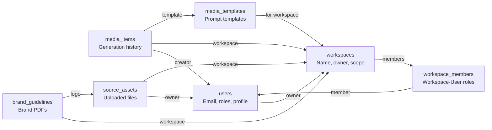

#### Connection Architecture

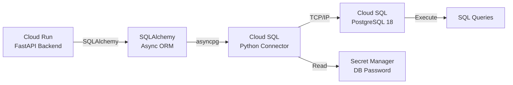

#### Key Features
- **Async Support**: SQLAlchemy AsyncSession for non-blocking database access
- **Connection Pooling**: Cloud SQL Python Connector manages connection lifecycle
- **Password Management**: Database password stored in Secret Manager
- **Migrations**: Alembic for schema versioning and migrations
- **Automatic Timestamps**: created_at and updated_at fields on all tables
- **JSON Columns**: JSONB columns for flexible data storage (source_assets, generation_parameters)
- **Array Columns**: PostgreSQL arrays for tags, URIs, color palettes

#### Query Examples

```python
# Get user with all workspaces
user = await session.execute(
    select(User).where(User.email == "user@example.com")
)

# Get media items by workspace
items = await session.execute(
    select(MediaItem)
    .where(MediaItem.workspace_id == workspace_id)
    .order_by(MediaItem.created_at.desc())
    .limit(50)
)

# Get workspace members with roles
members = await session.execute(
    select(WorkspaceMember)
    .join(User)
    .where(WorkspaceMember.workspace_id == workspace_id)
)
```

---

### Firestore Database Schema

```mermaid
graph LR
    FS["Firestore Database<br/>(Native Mode)"]

    subgraph Collections["Collections"]
        MediaLib["media_library<br/>Generated media items"]
        Users["users<br/>User profiles"]
        SourceAssets["source_assets<br/>Uploaded assets"]
        BrandGuides["brand_guidelines<br/>Brand PDFs"]
        Templates["media_templates<br/>Prompt templates"]
        Workspaces["workspaces<br/>Collaboration spaces"]
    end

    FS --> Collections

    subgraph Indexes["Auto-Generated Indexes"]
        Index1["media_library:<br/>workspace_id, user_email,<br/>created_at DESC"]
        Index2["source_assets:<br/>user_id, asset_type,<br/>created_at DESC"]
        Index3["media_library:<br/>status, created_at DESC"]
        Index4["users: role,<br/>created_at DESC"]
        Index5["brand_guidelines:<br/>workspace_id,<br/>created_at DESC"]
    end

    Collections --> Indexes
```

### Key Collections

#### media_library
Stores generated media with metadata
```
Fields:
- id (PK)
- workspace_id (FK)
- user_email (string)
- mime_type (video/mp4, image/png, etc.)
- model (imagen-3-fast, veo-1, chirp-1, etc.)
- status (pending, success, failed)
- prompt (string)
- source_asset_ids (array)
- gcs_uri (Cloud Storage path)
- created_at (timestamp)
- metadata (JSON object)
```

#### source_assets
Stores uploaded reference assets for generation
```
Fields:
- id (PK)
- workspace_id (FK)
- user_id (string)
- asset_type (garment, model, reference_image, etc.)
- scope (user, workspace, system)
- mime_type (image/png, image/jpeg, etc.)
- file_hash (string - deduplication)
- original_filename (string)
- gcs_uri (Cloud Storage path)
- created_at (timestamp)
```

#### users
User profile and role management
```
Fields:
- id (PK / email)
- email (string)
- role (admin, editor, viewer)
- workspace_id (FK)
- created_at (timestamp)
```

#### brand_guidelines
Uploaded brand style guides
```
Fields:
- id (PK)
- workspace_id (FK)
- pdf_uri (Cloud Storage path)
- extracted_text (string)
- created_at (timestamp)
```

#### media_templates
Prompt templates for quick generation
```
Fields:
- id (PK)
- workspace_id (FK)
- name (string)
- description (string)
- prompt (string)
- model (imagen-3-fast, veo-1, etc.)
- category (product, portrait, landscape, etc.)
- created_at (timestamp)
```

#### workspaces
Collaboration spaces
```
Fields:
- id (PK)
- name (string)
- owner_id (FK user)
- members (array of user IDs)
- created_at (timestamp)
```

---

## Google Cloud Platform Components

### Service Accounts & IAM Roles

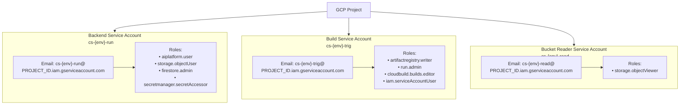

### Service Account Details & Permissions

#### Backend Runtime Service Account
**Account ID**: `cs-{env}-run`

**Purpose**: Executes backend API code on Cloud Run

**Permissions**:
```
roles/aiplatform.user
  └─ Call Vertex AI APIs (Imagen, Veo, Gemini, Chirp)

roles/storage.objectUser
  └─ Read/Write GenMedia bucket
  └─ Read signed URLs for media access

roles/firestore.admin
  └─ Full Firestore database access
  └─ Create/Update/Delete documents

roles/secretmanager.secretAccessor
  └─ Access runtime secrets from Secret Manager
```

#### Build Trigger Service Account
**Account ID**: `cs-{env}-trig`

**Purpose**: Cloud Build automation for CI/CD

**Permissions**:
```
roles/artifactregistry.writer
  └─ Push Docker images to Artifact Registry

roles/run.admin
  └─ Deploy & update Cloud Run services

roles/cloudbuild.builds.editor
  └─ Trigger and manage Cloud Build jobs

roles/iam.serviceAccountUser
  └─ Impersonate backend runtime SA for deployment
```

#### GenMedia Bucket Reader Service Account
**Account ID**: `cs-{env}-read`

**Purpose**: Generate signed URLs for media access (optional)

**Permissions**:
```
roles/storage.objectViewer
  └─ View GenMedia bucket objects
  └─ Generate presigned URLs for media access
```

### Key GCP Services

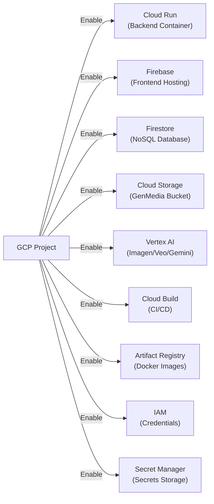

| Service | Purpose | Role |
|---------|---------|------|
| **Cloud Run** | Backend API container execution | Serverless compute |
| **Firebase Hosting** | Static frontend SPA hosting | Frontend serving |
| **Firestore** | NoSQL document database | Primary data store |
| **Cloud Storage** | Media file storage | GenMedia bucket |
| **Vertex AI** | Generative AI model APIs | ML model access |
| **Cloud Build** | CI/CD automation | Deployment pipeline |
| **Artifact Registry** | Docker image repository | Image storage |
| **IAM** | Identity & access management | Security |
| **Secret Manager** | Encrypted secrets storage | Credentials |

---

## Infrastructure as Code (Terraform)

### Terraform Module Structure

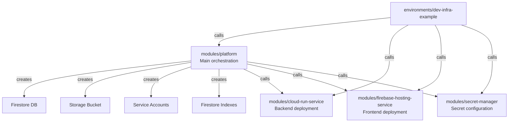

### Module Overview

| Module | Responsibility |
|--------|-----------------|
| **platform** | Core infrastructure (Firestore, Storage, IAM, Indexes) |
| **cloud-run-service** | Backend API deployment, Cloud Build triggers |
| **firebase-hosting-service** | Frontend hosting and deployment |
| **secret-manager** | Secret access configuration |

### Terraform Variables (Environment-Based)

```
Input Variables (infra/environments/dev-infra-example/terraform.tfvars):

gcp_project_id          # Google Cloud Project ID
gcp_region              # Deployment region (e.g., us-central1)
environment             # Environment name (dev, staging, prod)

Backend Configuration:
backend_service_name    # Cloud Run service name
be_env_vars             # Backend environment variables
be_cpu                  # Backend CPU allocation
be_memory               # Backend memory allocation
backend_runtime_secrets # Secret references
backend_custom_audiences# OIDC audiences

Frontend Configuration:
frontend_service_name   # Firebase service name
frontend_custom_audiences# OIDC audiences
fe_build_substitutions  # Build-time substitutions

GitHub Integration:
github_conn_name        # Cloud Build connection name
github_repo_owner       # Repository owner
github_repo_name        # Repository name
github_branch_name      # Deployment branch

Secret Configuration:
frontend_secrets        # Frontend secret names
backend_secrets         # Backend secret names

APIs to Enable:
apis_to_enable          # List of GCP APIs to activate
```

---

## CI/CD Pipeline

### Cloud Build Workflow

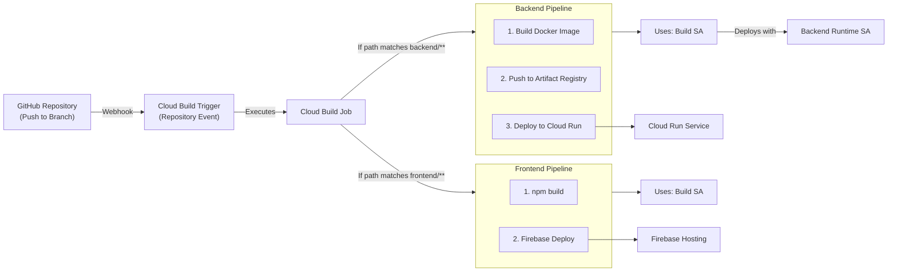

### Build Configuration Files

**Backend**: `backend/cloudbuild.yaml`
- Builds Docker image from Dockerfile
- Pushes to Artifact Registry
- Deploys new image to Cloud Run service

**Frontend**: `frontend/cloudbuild-deploy.yaml`
- Runs npm build for Angular compilation
- Deploys built assets to Firebase Hosting
- Updates build substitutions for API URLs

---

## Deployment Architecture Diagram

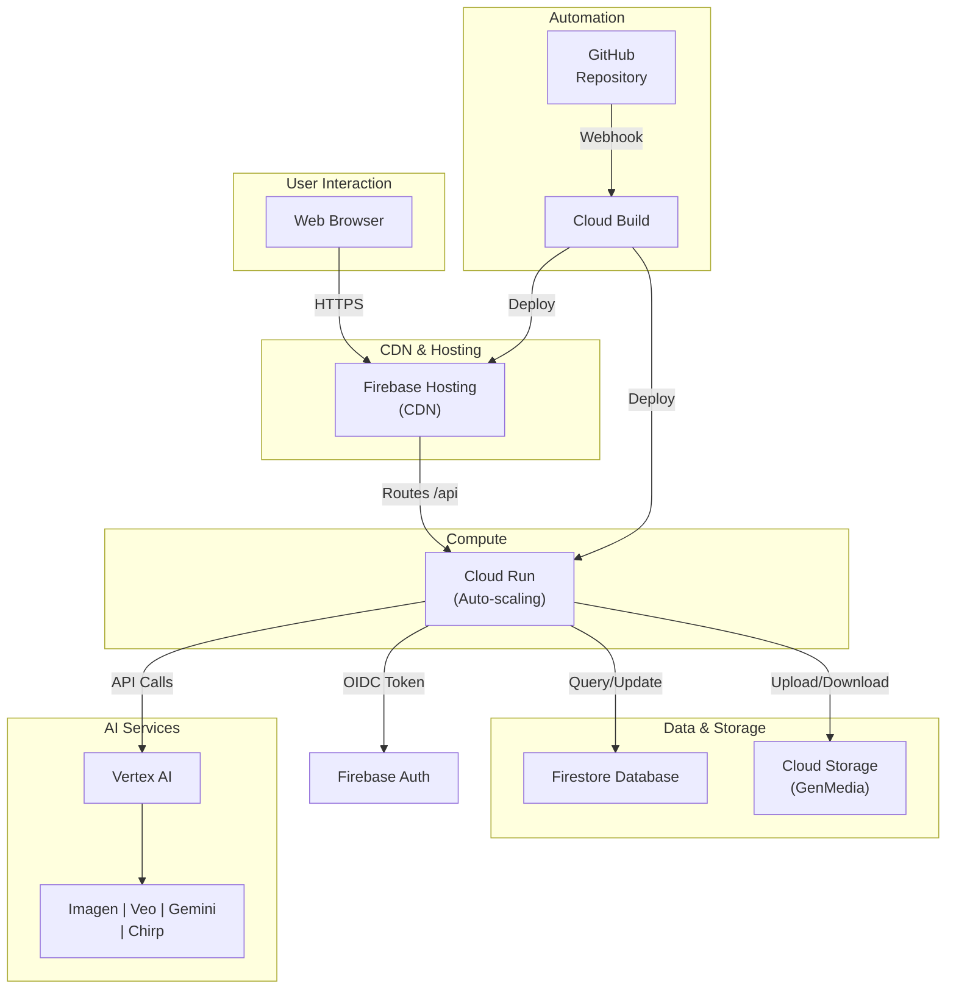

---

## Authentication & Security Flow

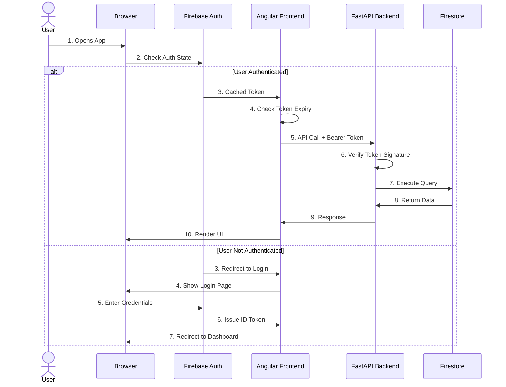

---

## Environment Configuration

### Local Development
```
docker-compose.yml
├── Backend Service
│   ├── Port: 8080
│   ├── Reload: Enabled
│   └── Volume: ./backend:/app
├── Frontend Service
│   ├── Port: 4200
│   ├── Hot reload: Enabled
│   └── Volume: ./frontend/src:/app/src
└── Volumes
    └── backend_venv (Python environment)
```

### Production Deployment (GCP)
```
Cloud Run (Backend)
├── Service Account: cs-prod-run
├── Region: var.gcp_region
├── Min Instances: 1
├── Max Instances: auto-scaled
└── Secrets: From Secret Manager

Firebase Hosting (Frontend)
├── Custom Domain: PROJECT_ID.web.app
├── CDN: Google CDN
├── Rewrite: /api/* → Cloud Run backend
└── Secrets: From Secret Manager
```

---

## Key Features Architecture

### 1. Image Generation (Imagen)
```
User Prompt
    ↓
Brand Guidelines (if provided)
    ↓
Gemini: Enhance Prompt
    ↓
Imagen API Call
    ↓
Generated Image
    ↓
Store in GCS + Firestore metadata
```

### 2. Video Generation (Veo)
```
User Prompt + Optional Reference Image
    ↓
Image-to-Video or Text-to-Video
    ↓
Veo API Call
    ↓
Generated Video (polling for completion)
    ↓
Store in GCS + Firestore metadata
```

### 3. Virtual Try-On (VTO)
```
System Assets (Garments, Models)
    ↓
Source Assets Storage (user uploads)
    ↓
VTO API Integration
    ↓
Real-time Preview
```

### 4. Brand Guidelines Processing
```
User Uploads PDF
    ↓
GCS Signed URL Upload (bypass timeout)
    ↓
Backend Processing
    ↓
PDF Text Extraction
    ↓
Store Reference in Firestore
    ↓
Integrate into Generation Prompts
```

---

## Network & Security

### CORS Configuration
```
Production:
  Allowed Origins: FRONTEND_URL (Firebase domain)

Development:
  Allowed Origins: * (all domains)

Methods: GET, POST, PUT, DELETE, PATCH
Credentials: Allowed
```

### Cloud Run Security
- No public unauthenticated access (except health checks)
- Firebase OIDC token validation on all endpoints
- Environment variables from Secret Manager
- Private service account per environment

### Firestore Security
- Rules configured per environment
- User-based access control
- Workspace-level isolation

### Cloud Storage Security
- Signed URLs for temporary access
- Bucket-level IAM policies
- Optional: Service account-based presigned URL generation

---

## Scaling & Performance

### Backend Scaling (Cloud Run)
- **Min Instances**: 1 (always warm)
- **Max Instances**: Auto-scaled based on traffic
- **Timeout**: 3600 seconds (1 hour for long-running tasks)
- **Memory**: Configurable (e.g., 2Gi, 4Gi)
- **CPU**: Configurable (e.g., 1, 2, 4)

### Database Scaling (Firestore)
- **Mode**: Native (automatically scaled)
- **Indexes**: Composite indexes for common queries
- **Read/Write Capacity**: On-demand pricing model

### Frontend Delivery
- **CDN**: Firebase Hosting uses Google Cloud CDN
- **Cache**: Browser caching + CDN edge caching
- **Rewrite Rules**: /api/* routes to Cloud Run backend

---

## Monitoring & Logging

### Backend Logging
```
Logger Config: logger_config.py
├── Handler: Console output
├── Format: JSON for Cloud Logging integration
└── Level: INFO (production) / DEBUG (development)

Cloud Logging Integration:
├── Automatic log ingestion
├── Log Explorer in Google Cloud Console
└── Stackdriver error tracking
```

### Key Metrics to Monitor
- Cloud Run request latency
- Cloud Run error rate
- Firestore read/write operations
- Cloud Storage operations
- Vertex AI API latency

---

## Deployment Instructions

### Prerequisites
1. GCP Project with billing enabled
2. Google Cloud CLI installed
3. Terraform installed
4. GitHub repository access
5. Required APIs enabled

### Deploy via Terraform
```bash
cd infra/environments/dev-infra-example

# Initialize Terraform
terraform init

# Plan deployment
terraform plan -out=tfplan

# Apply configuration
terraform apply tfplan
```

### Environment Variables
Backend services require:
- `PROJECT_ID`: GCP Project ID
- `GENMEDIA_BUCKET`: Cloud Storage bucket name
- `ENVIRONMENT`: dev, staging, or prod
- `FRONTEND_URL`: Frontend domain (production)

---

## Technology Decisions & Rationale

| Component | Choice | Rationale |
|-----------|--------|-----------|
| Frontend Framework | Angular 18 | Enterprise-grade, full-featured framework |
| Backend Framework | FastAPI | High performance, modern Python async |
| Database | Firestore | Flexible NoSQL, built-in auth integration |
| Compute | Cloud Run | Serverless, auto-scaling, cost-effective |
| AI Models | Vertex AI | Unified Google AI platform, production-ready |
| IaC | Terraform | Provider-agnostic, version-controllable |
| Auth | Firebase Auth | Simple to integrate, multi-factor support |
| CI/CD | Cloud Build | Native GCP integration, GitHub connected |
| Code Style | Google Style Guides | Consistency, industry standard |

---

## Appendix: Useful Commands

### Local Development
```bash
# Frontend
cd frontend
npm install
npm start

# Backend
cd backend
python3 -m venv .venv
source .venv/bin/activate
pip install -r requirements.txt
python main.py

# Docker Compose
docker-compose up --build
```

### Production Deployment
```bash
# Terraform
cd infra/environments/dev-infra-example
terraform apply

# Manual Cloud Run deployment
gcloud run deploy creative-studio \
  --source . \
  --region us-central1 \
  --service-account cs-prod-run@PROJECT_ID.iam.gserviceaccount.com
```

### Useful GCP Commands
```bash
# View Cloud Run logs
gcloud run logs read creative-studio --region=us-central1 --limit=50

# Check Firestore database
gcloud firestore databases list

# View service accounts
gcloud iam service-accounts list

# List Terraform state
terraform state list
```

---

## Document Information

- **Last Updated**: December 2025
- **Status**: Production Ready
- **Maintainers**: Creative Studio Development Team
- **License**: Apache License 2.0
