# Infrastructure & Deployment Guide

## Overview

This document details the complete infrastructure setup, Terraform configuration, service accounts, IAM roles, and deployment procedures for Creative Studio on Google Cloud Platform.

---

## GCP Service Architecture

### Service Ecosystem

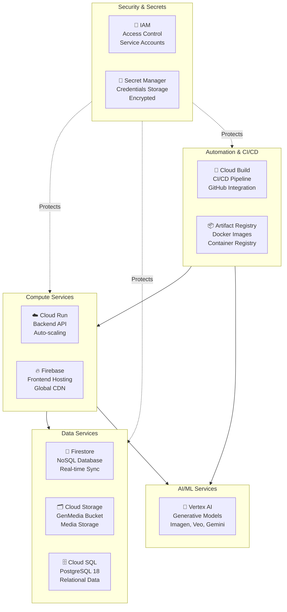

---

## Cloud SQL PostgreSQL Database

### Overview

Creative Studio uses **Google Cloud SQL with PostgreSQL 18** as the primary relational database. This complements Firestore (NoSQL) by storing structured data with strong consistency requirements.

### Database Purpose

The PostgreSQL instance stores:
- **Users**: User profiles, roles, metadata (replicated from Firebase)
- **Workspaces**: Workspace configurations, ownership, scopes
- **Workspace Members**: Membership relationships and roles (admin, editor, viewer)
- **Media Items**: Generation history, metadata, status, prompts, parameters
- **Media Templates**: Template definitions, variables, generation parameters
- **Source Assets**: Uploaded assets, metadata, workspace associations
- **Brand Guidelines**: Brand guidelines, extracted text, summaries, color palettes

### Architecture

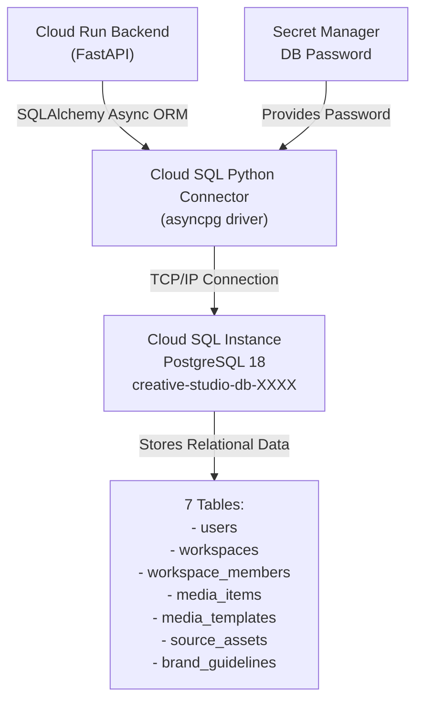

### Database Schema

#### Users Table
```sql
CREATE TABLE users (
    id INTEGER PRIMARY KEY AUTOINCREMENT,
    email VARCHAR UNIQUE NOT NULL,           -- Firebase email
    roles VARCHAR[] NOT NULL,                -- ["admin", "editor", "viewer"]
    name VARCHAR NOT NULL,                   -- User's full name
    picture VARCHAR NOT NULL,                -- Avatar URL
    created_at TIMESTAMP DEFAULT now(),
    updated_at TIMESTAMP DEFAULT now()
);
```

#### Workspaces Table
```sql
CREATE TABLE workspaces (
    id INTEGER PRIMARY KEY AUTOINCREMENT,
    name VARCHAR NOT NULL,                   -- Workspace name
    owner_id INTEGER NOT NULL REFERENCES users(id),
    scope VARCHAR NOT NULL,                  -- "personal" or "organization"
    created_at TIMESTAMP DEFAULT now(),
    updated_at TIMESTAMP DEFAULT now()
);
```

#### Workspace Members Table
```sql
CREATE TABLE workspace_members (
    workspace_id INTEGER NOT NULL REFERENCES workspaces(id),
    user_id INTEGER NOT NULL REFERENCES users(id),
    role VARCHAR NOT NULL,                   -- "admin", "editor", "viewer"
    PRIMARY KEY (workspace_id, user_id)
);
```

#### Media Items Table
```sql
CREATE TABLE media_items (
    id INTEGER PRIMARY KEY AUTOINCREMENT,
    workspace_id INTEGER NOT NULL REFERENCES workspaces(id),
    user_email VARCHAR NOT NULL,
    user_id INTEGER REFERENCES users(id),
    mime_type VARCHAR NOT NULL,              -- "image/png", "video/mp4", "audio/mp3"
    model VARCHAR NOT NULL,                  -- "imagen", "veo", "chirp", "gemini"
    prompt TEXT,                             -- User's original prompt
    original_prompt TEXT,
    rewritten_prompt TEXT,
    num_media INTEGER,
    generation_time FLOAT,
    error_message TEXT,
    aspect_ratio VARCHAR,
    style VARCHAR,
    lighting VARCHAR,
    color_and_tone VARCHAR,
    composition VARCHAR,
    negative_prompt TEXT,
    add_watermark BOOLEAN,
    status VARCHAR NOT NULL,                 -- "pending", "success", "failed"
    source_assets JSONB,                     -- References to source_assets
    source_media_items JSONB,                -- References to other media_items
    gcs_uris VARCHAR[],                      -- Generated file URLs
    duration_seconds FLOAT,
    thumbnail_uris VARCHAR[],
    comment TEXT,
    seed INTEGER,
    critique TEXT,
    google_search BOOLEAN,
    resolution VARCHAR,
    grounding_metadata JSONB,
    audio_analysis JSONB,
    voice_name VARCHAR,
    language_code VARCHAR,
    raw_data JSONB,                          -- Full API response
    created_from_template_id INTEGER REFERENCES media_templates(id),
    created_at TIMESTAMP DEFAULT now(),
    updated_at TIMESTAMP DEFAULT now()
);
```

#### Media Templates Table
```sql
CREATE TABLE media_templates (
    id INTEGER PRIMARY KEY AUTOINCREMENT,
    name VARCHAR NOT NULL,
    description VARCHAR NOT NULL,
    mime_type VARCHAR NOT NULL,              -- "image/png", "video/mp4", "audio/mp3"
    industry VARCHAR,
    brand VARCHAR,
    tags VARCHAR[],
    gcs_uris VARCHAR[],                      -- Template file URLs
    thumbnail_uris VARCHAR[],
    generation_parameters JSONB,             -- API parameters with variables
    source_assets JSONB,                     -- Default source assets
    created_at TIMESTAMP DEFAULT now(),
    updated_at TIMESTAMP DEFAULT now()
);
```

#### Source Assets Table
```sql
CREATE TABLE source_assets (
    id INTEGER PRIMARY KEY AUTOINCREMENT,
    workspace_id INTEGER NOT NULL REFERENCES workspaces(id),
    user_id INTEGER NOT NULL REFERENCES users(id),
    gcs_uri VARCHAR NOT NULL,                -- Cloud Storage location
    original_filename VARCHAR NOT NULL,
    mime_type VARCHAR NOT NULL,              -- "image/png", "video/mp4", etc.
    aspect_ratio VARCHAR NOT NULL,
    file_hash VARCHAR NOT NULL,              -- SHA256 hash
    scope VARCHAR NOT NULL,                  -- "personal" or "workspace"
    asset_type VARCHAR NOT NULL,             -- "image", "video", "audio", "document"
    thumbnail_gcs_uri VARCHAR,               -- Optional thumbnail
    created_at TIMESTAMP DEFAULT now(),
    updated_at TIMESTAMP DEFAULT now()
);
```

#### Brand Guidelines Table
```sql
CREATE TABLE brand_guidelines (
    id INTEGER PRIMARY KEY AUTOINCREMENT,
    name VARCHAR NOT NULL,
    status VARCHAR NOT NULL,                 -- "pending", "success", "failed"
    error_message TEXT,
    workspace_id INTEGER REFERENCES workspaces(id),
    source_pdf_gcs_uris VARCHAR[],          -- Original PDF files
    color_palette VARCHAR[],                 -- Extracted colors
    logo_asset_id INTEGER REFERENCES source_assets(id),
    guideline_text TEXT,                     -- Full extracted text
    tone_of_voice_summary TEXT,              -- Gemini-generated summary
    visual_style_summary TEXT,               -- Gemini-generated summary
    created_at TIMESTAMP DEFAULT now(),
    updated_at TIMESTAMP DEFAULT now()
);
```

### Terraform Configuration

```hcl
# infra/modules/postgresql/main.tf

resource "random_id" "db_name_suffix" {
  byte_length = 4
}

resource "google_sql_database_instance" "default" {
  name             = "creative-studio-db-${random_id.db_name_suffix.hex}"
  database_version = "POSTGRES_18"           # Latest stable version
  region           = var.region
  project          = var.project_id

  settings {
    tier = "db-perf-optimized-N-2"           # Performance-optimized machine type

    # Enable IAM authentication for enhanced security
    database_flags {
      name  = "cloudsql.iam_authentication"
      value = "on"
    }

    # Network configuration
    ip_configuration {
      ipv4_enabled = true                    # Allow public IP for Cloud Run connections
    }
  }

  deletion_protection = false                # Set to true for production
}

# Create the database
resource "google_sql_database" "default" {
  name     = var.db_name
  instance = google_sql_database_instance.default.name
  project  = var.project_id
}

# Create database user
resource "google_sql_user" "default" {
  name     = var.db_user
  instance = google_sql_database_instance.default.name
  password = var.db_password
  project  = var.project_id
}
```

### Backend Connection Configuration

The FastAPI backend uses the **Cloud SQL Python Connector** with SQLAlchemy async ORM:

**Backend Configuration** (`backend/src/database.py`):
```python
from google.cloud.sql.connector import Connector, IPTypes
from sqlalchemy.ext.asyncio import create_async_engine, AsyncSession

class DatabaseConnector:
    """Manages Cloud SQL Connector lifecycle"""
    _instance = None
    _connector = None

    def get_connector(self) -> Connector:
        if self._connector is None:
            import asyncio
            self._connector = Connector(loop=asyncio.get_running_loop())
        return self._connector

async def get_connection():
    """Create async connection to Cloud SQL"""
    connector = DatabaseConnector.get_instance().get_connector()

    conn = await connector.connect_async(
        config_service.INSTANCE_CONNECTION_NAME,  # "project:region:instance"
        "asyncpg",
        user=config_service.DB_USER,
        password=config_service.DB_PASS,
        db=config_service.DB_NAME,
        ip_type=IPTypes.PUBLIC,
    )
    return conn

# Create async engine
engine = create_async_engine(
    "postgresql+asyncpg://",
    async_creator=get_connection,
    echo=config_service.LOG_LEVEL == "DEBUG",
)

# Session factory
AsyncSessionLocal = async_sessionmaker(
    bind=engine,
    class_=AsyncSession,
    expire_on_commit=False,
)
```

### Environment Variables

Required environment variables for Cloud SQL connection:

```bash
# Cloud SQL connection details
INSTANCE_CONNECTION_NAME="project-id:region:creative-studio-db-xxxx"
DB_NAME="creative_studio"
DB_USER="creative_studio_user"
DB_PASS=${DB_PASSWORD_SECRET}                # From Secret Manager

# Optional: Use Cloud SQL Auth Proxy
USE_CLOUD_SQL_AUTH_PROXY=false               # Python Connector is preferred
```

### Database Migrations with Alembic

The project uses **Alembic** for schema versioning:

```bash
# Create initial migration
alembic revision --autogenerate -m "Initial schema"

# Apply migrations (done automatically at startup)
alembic upgrade head

# View migration history
alembic history
```

Current migrations are stored in `backend/alembic/versions/`:
```
├── 6591e10bbab7_initial_schema.py
```

### Query Examples

**Get user with workspaces**:
```python
from src.users.user_model import User
from src.workspaces.workspace_model import Workspace

async with AsyncSessionLocal() as session:
    user = await session.execute(
        select(User).where(User.email == "user@example.com")
    )
    user = user.scalar_one_or_none()

    # Lazy-load workspaces
    workspaces = user.workspaces  # Requires relationship definition
```

**Get media items by workspace**:
```python
from src.common.schema.media_item_model import MediaItem

async with AsyncSessionLocal() as session:
    items = await session.execute(
        select(MediaItem)
        .where(MediaItem.workspace_id == workspace_id)
        .order_by(MediaItem.created_at.desc())
        .limit(50)
    )
    media_items = items.scalars().all()
```

### Backup & Recovery

Cloud SQL provides automatic backups:

```bash
# Enable automated backups (via Terraform)
settings {
  backup_configuration {
    enabled                        = true
    start_time                     = "03:00"  # UTC
    location                       = "us"     # Backup region
    backup_retention_settings {
      retained_backups             = 30       # Keep 30 backups
      retention_unit               = "COUNT"
    }
  }
}

# Manual backup
gcloud sql backups create --instance=creative-studio-db-xxxx

# Restore from backup
gcloud sql backups describe BACKUP_ID --instance=creative-studio-db-xxxx
gcloud sql backups restore BACKUP_ID --backup-instance=creative-studio-db-xxxx
```

---

## Terraform Configuration

### Project Structure

```
infra/
├── environments/
│   └── dev-infra-example/           # Environment example
│       ├── main.tf                  # Main configuration
│       ├── variables.tf             # Input variables
│       ├── outputs.tf               # Output values
│       ├── terraform.tfvars         # Variable values
│       └── backend.tf               # State management
│
└── modules/
    ├── platform/                    # Core platform
    │   ├── main.tf
    │   ├── variables.tf
    │   └── outputs.tf
    ├── cloud-run-service/           # Backend service
    │   ├── main.tf
    │   ├── variables.tf
    │   └── outputs.tf
    ├── firebase-hosting-service/    # Frontend service
    │   ├── main.tf
    │   ├── variables.tf
    │   └── outputs.tf
    └── secret-manager/              # Secret management
        ├── main.tf
        ├── variables.tf
        └── outputs.tf
```

### Variable Flow

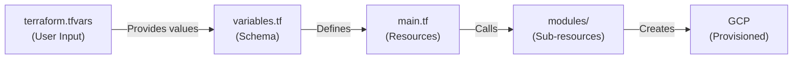

---

## Service Accounts & IAM Configuration

### Service Account Hierarchy

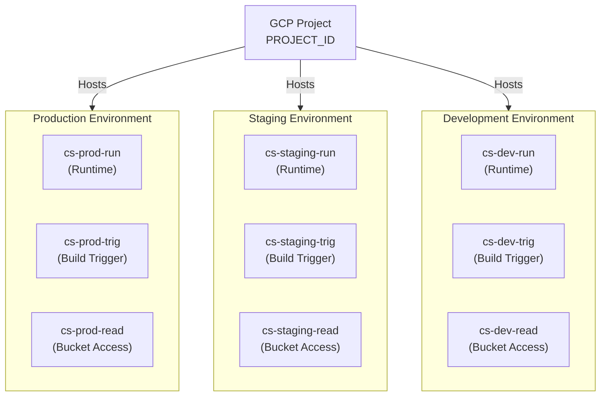

### Backend Runtime Service Account

**Account ID**: `cs-{environment}-run`
**Display Name**: `SA for creative-studio-backend ({environment}) Runtime`

#### Purpose
Executes backend API code on Cloud Run. All Vertex AI API calls and database operations run under this service account.

#### IAM Roles

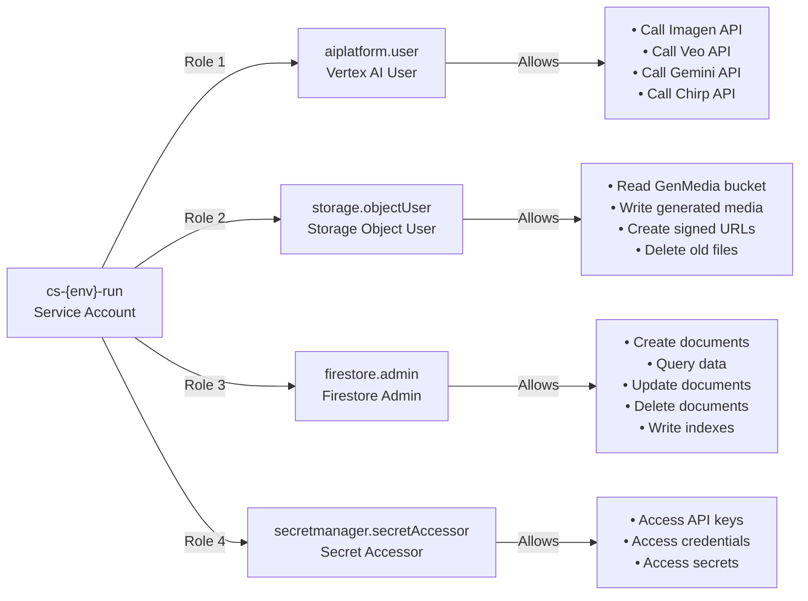

#### Terraform Code
```hcl
resource "google_service_account" "run_sa" {
  account_id   = "cs-${var.environment}-run"
  display_name = "SA for creative-studio-backend (${var.environment}) Runtime"
  project      = var.gcp_project_id
}

# Vertex AI permissions
resource "google_project_iam_member" "run_sa_aiplatform" {
  project = var.gcp_project_id
  role    = "roles/aiplatform.user"
  member  = "serviceAccount:${google_service_account.run_sa.email}"
}

# Storage permissions
resource "google_project_iam_member" "run_sa_storage" {
  project = var.gcp_project_id
  role    = "roles/storage.objectUser"
  member  = "serviceAccount:${google_service_account.run_sa.email}"
}

# Firestore permissions
resource "google_project_iam_member" "run_sa_firestore" {
  project = var.gcp_project_id
  role    = "roles/firestore.admin"
  member  = "serviceAccount:${google_service_account.run_sa.email}"
}

# Secret Manager permissions
resource "google_project_iam_member" "run_sa_secrets" {
  project = var.gcp_project_id
  role    = "roles/secretmanager.secretAccessor"
  member  = "serviceAccount:${google_service_account.run_sa.email}"
}
```

#### Usage Example
```python
# In FastAPI backend code
from google.auth import default

# Credentials automatically picked up from Cloud Run environment
credentials, project = default()

# Service account is: cs-prod-run@PROJECT_ID.iam.gserviceaccount.com
# All API calls use this account's permissions
client = aiplatform.Client(credentials=credentials)
```

---

### Build Trigger Service Account

**Account ID**: `cs-{environment}-trig`
**Display Name**: `SA for creative-studio-backend ({environment}) Trigger`

#### Purpose
Used by Cloud Build to execute CI/CD pipelines. Handles Docker image building, pushing to Artifact Registry, and deploying to Cloud Run.

#### IAM Roles

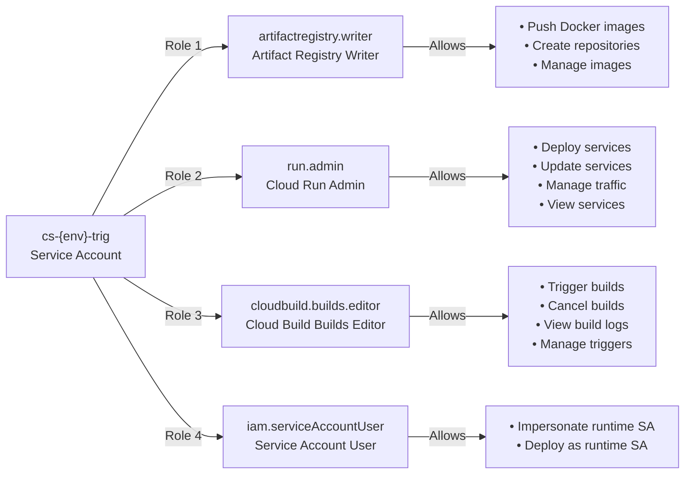

#### Terraform Code
```hcl
resource "google_service_account" "trigger_sa" {
  account_id   = "cs-${var.environment}-trig"
  display_name = "SA for creative-studio-backend (${var.environment}) Trigger"
  project      = var.gcp_project_id
}

# Artifact Registry permissions
resource "google_project_iam_member" "trigger_sa_ar" {
  project = var.gcp_project_id
  role    = "roles/artifactregistry.writer"
  member  = "serviceAccount:${google_service_account.trigger_sa.email}"
}

# Cloud Run permissions
resource "google_project_iam_member" "trigger_sa_run" {
  project = var.gcp_project_id
  role    = "roles/run.admin"
  member  = "serviceAccount:${google_service_account.trigger_sa.email}"
}

# Cloud Build permissions
resource "google_project_iam_member" "trigger_sa_build" {
  project = var.gcp_project_id
  role    = "roles/cloudbuild.builds.editor"
  member  = "serviceAccount:${google_service_account.trigger_sa.email}"
}

# IAM Service Account User (to impersonate runtime SA)
resource "google_project_iam_member" "trigger_sa_iam" {
  project = var.gcp_project_id
  role    = "roles/iam.serviceAccountUser"
  member  = "serviceAccount:${google_service_account.trigger_sa.email}"
}
```

#### CI/CD Pipeline Usage
```yaml
steps:
  # Step 1: Build Docker image
  - name: gcr.io/cloud-builders/docker
    args: ['build', '-t', 'us-central1-docker.pkg.dev/PROJECT/REPO/backend:latest', '.']

  # Step 2: Push to Artifact Registry (uses trigger SA)
  - name: gcr.io/cloud-builders/docker
    args: ['push', 'us-central1-docker.pkg.dev/PROJECT/REPO/backend:latest']

  # Step 3: Deploy to Cloud Run (uses trigger SA, deploys with runtime SA)
  - name: gcr.io/cloud-builders/gke-deploy
    args: ['run', 'deploy', '--filename', 'creative-studio']
    env:
      - 'CLOUDSDK_COMPUTE_REGION=us-central1'
      - 'CLOUDSDK_CONTAINER_CLUSTER=creative-studio'
```

---

### Bucket Reader Service Account (Optional)

**Account ID**: `cs-{environment}-read`
**Display Name**: `SA for reading GenMedia ({environment}) bucket`

#### Purpose
Used to generate presigned URLs for media access when organizational restrictions prevent public bucket access.

#### IAM Roles

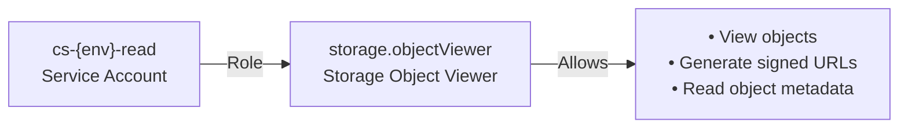

#### Terraform Code
```hcl
resource "google_service_account" "bucket_reader_sa" {
  account_id   = "cs-${var.environment}-read"
  display_name = "SA for reading GenMedia (${var.environment}) bucket"
  project      = var.gcp_project_id
}

# Storage Object Viewer role on the bucket
resource "google_storage_bucket_iam_member" "bucket_reader" {
  bucket = google_storage_bucket.genmedia.name
  role   = "roles/storage.objectViewer"
  member = "serviceAccount:${google_service_account.bucket_reader_sa.email}"
}
```

#### Usage
```python
from google.oauth2 import service_account

# Load bucket reader service account
credentials = service_account.Credentials.from_service_account_file(
    'bucket-reader-key.json'
)

# Generate presigned URL
from google.cloud import storage
client = storage.Client(credentials=credentials)
bucket = client.bucket('genmedia-bucket')
blob = bucket.blob('path/to/image.png')

url = blob.generate_signed_url(
    version="v4",
    expiration=timedelta(hours=1),
    method="GET"
)
```

---

## Cloud Run Service Deployment

### Service Configuration

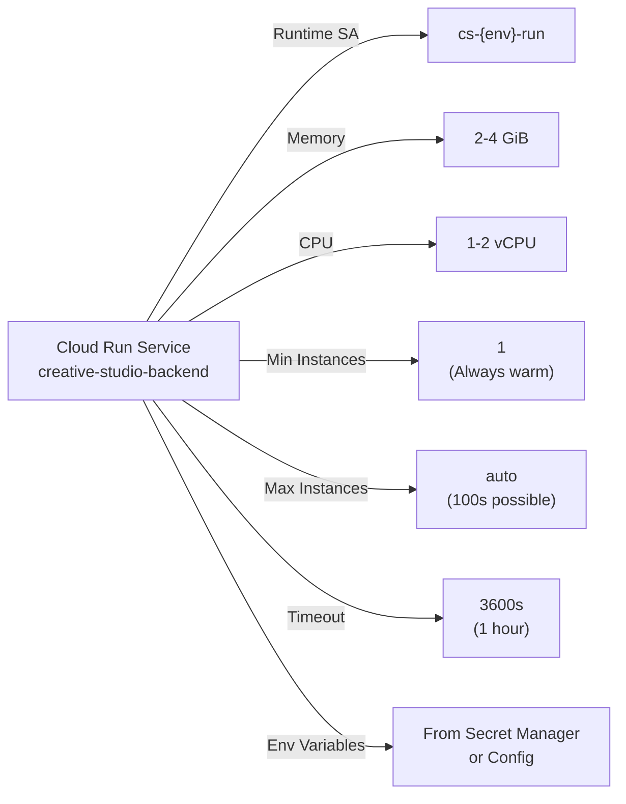

### Terraform Configuration

```hcl
resource "google_cloud_run_v2_service" "backend" {
  name     = "creative-studio-backend"
  location = var.gcp_region

  # Deletion protection
  deletion_protection = false

  template {
    # Service account for runtime
    service_account = google_service_account.run_sa.email

    containers {
      # Image from Artifact Registry
      image = "us-central1-docker.pkg.dev/PROJECT_ID/REPO/backend:latest"

      # Resource limits
      resources {
        limits = {
          cpu    = "2"
          memory = "4Gi"
        }
      }

      # Environment variables (non-secret)
      env {
        name  = "GENMEDIA_BUCKET"
        value = google_storage_bucket.genmedia.name
      }
      env {
        name  = "PROJECT_ID"
        value = var.gcp_project_id
      }

      # Secret environment variables
      env {
        name = "API_KEY"
        value_source {
          secret_key_ref {
            secret  = "api-key"
            version = "latest"
          }
        }
      }
    }

    # Scaling configuration
    scaling {
      min_instance_count = 1
      max_instance_count = 100
    }
  }

  lifecycle {
    ignore_changes = [template[0].containers[0].image]
  }
}
```

---

## Firebase Hosting Deployment

### Firebase Project Setup

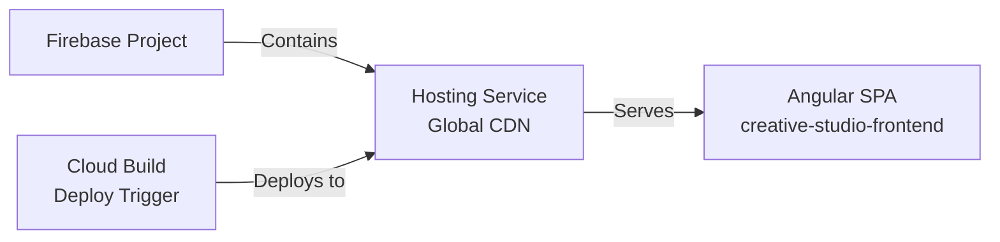

### Terraform Configuration

```hcl
# Enable Firebase in the project
resource "google_firebase_project" "default" {
  provider = google-beta
  project  = var.gcp_project_id
}

# Create a Cloud Build trigger for Firebase deployment
resource "google_cloud_build_github_trigger" "frontend" {
  name           = "creative-studio-frontend-deploy"
  description    = "Deploy frontend to Firebase Hosting"
  filename       = "frontend/cloudbuild-deploy.yaml"
  owner          = var.github_repo_owner
  repo           = var.github_repo_name
  branch         = var.github_branch_name
  service_account = google_service_account.trigger_sa.id

  # Only trigger on changes to frontend code
  included_files = ["frontend/**"]
}
```

### Firebase Configuration

`firebase.json`:
```json
{
  "hosting": {
    "public": "dist/creative-studio/browser",
    "rewrites": [
      {
        "source": "/api/**",
        "run": {
          "serviceId": "creative-studio-backend",
          "region": "us-central1"
        }
      },
      {
        "source": "**",
        "destination": "/index.html"
      }
    ],
    "headers": [
      {
        "source": "/index.html",
        "headers": [
          {
            "key": "Cache-Control",
            "value": "max-age=300"
          }
        ]
      },
      {
        "source": "/assets/**",
        "headers": [
          {
            "key": "Cache-Control",
            "value": "max-age=31536000"
          }
        ]
      }
    ]
  }
}
```

---

## Storage Configuration

### GenMedia Bucket Setup

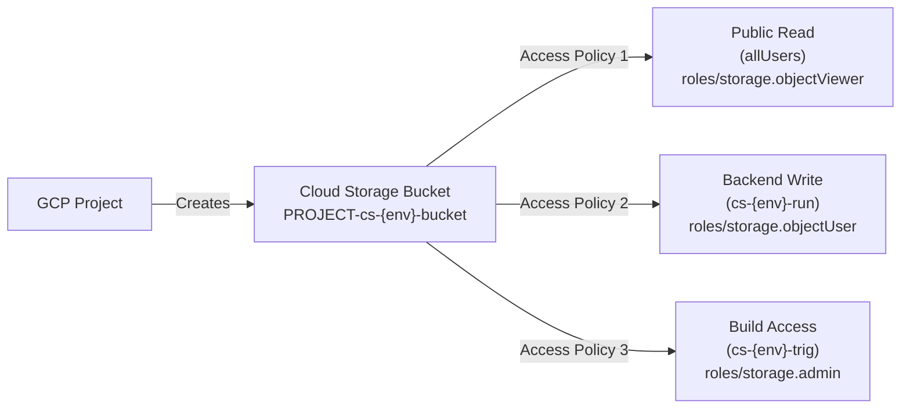

### Terraform Configuration

```hcl
# Create the bucket
resource "google_storage_bucket" "genmedia" {
  name                        = "${var.gcp_project_id}-cs-${var.environment}-bucket"
  location                    = var.gcp_region
  uniform_bucket_level_access = true
}

# Public read access (optional - set based on organizational policy)
resource "google_storage_bucket_iam_member" "public_read" {
  bucket = google_storage_bucket.genmedia.name
  role   = "roles/storage.objectViewer"
  member = "allUsers"
}

# Backend service account write access
resource "google_storage_bucket_iam_member" "backend_write" {
  bucket = google_storage_bucket.genmedia.name
  role   = "roles/storage.objectUser"
  member = "serviceAccount:${google_service_account.run_sa.email}"
}

# Build trigger admin access
resource "google_storage_bucket_iam_member" "build_admin" {
  bucket = google_storage_bucket.genmedia.name
  role   = "roles/storage.admin"
  member = "serviceAccount:${google_service_account.trigger_sa.email}"
}
```

### Signed URLs (When Public Access Restricted)

If organizational policies prevent public bucket access, use the bucket reader SA:

```python
from google.oauth2 import service_account
from google.cloud import storage
from datetime import timedelta

# Load the bucket reader service account
credentials = service_account.Credentials.from_service_account_file(
    'cs-read-sa-key.json'
)

# Create client with bucket reader credentials
client = storage.Client(credentials=credentials)
bucket = client.bucket('PROJECT_ID-cs-prod-bucket')
blob = bucket.blob('media/image-12345.png')

# Generate presigned URL valid for 1 hour
signed_url = blob.generate_signed_url(
    version="v4",
    expiration=timedelta(hours=1),
    method="GET"
)
```

---

## Firestore Database Configuration

### Database Creation

```hcl
resource "google_firestore_database" "default" {
  project         = var.gcp_project_id
  name            = "creative-studio-${var.environment}"
  location_id     = var.gcp_region
  type            = "FIRESTORE_NATIVE"  # Modern, recommended

  depends_on = [
    google_firebase_project.default
  ]
}
```

### Index Management

Terraform automatically creates composite indexes for complex queries:

```hcl
# Example: Index for common media_library query
resource "google_firestore_index" "media_library_user_created" {
  project    = var.gcp_project_id
  database   = google_firestore_database.default.name
  collection = "media_library"

  fields {
    field_path = "user_email"
    order      = "ASCENDING"
  }
  fields {
    field_path = "created_at"
    order      = "DESCENDING"
  }
}
```

### Firestore Rules (Security)

Create `firestore.rules`:
```
rules_version = '2';

service cloud.firestore {
  match /databases/{database}/documents {
    // Users can only read/write their own documents
    match /media_library/{doc=**} {
      allow read, write: if request.auth.token.email == resource.data.user_email;
    }

    match /users/{uid} {
      allow read, write: if request.auth.uid == uid;
    }

    match /workspaces/{workspace} {
      allow read: if request.auth.uid in resource.data.members;
      allow write: if request.auth.uid == resource.data.owner_id;
    }
  }
}
```

Deploy with:
```bash
firebase deploy --only firestore:rules
```

---

## Secret Manager Configuration

### Storing Secrets

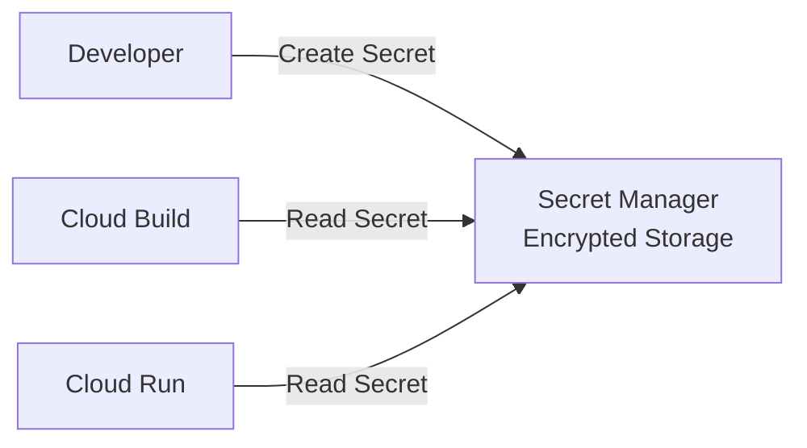

### Terraform Module

```hcl
module "backend_secrets" {
  source = "../secret-manager"

  gcp_project_id    = var.gcp_project_id
  secret_names      = var.backend_secrets
  accessor_sa_email = google_service_account.run_sa.email

  # Variables from tfvars:
  # backend_secrets = {
  #   "API_KEY" = "your-api-key"
  #   "DB_PASSWORD" = "secure-password"
  # }
}
```

### Secret Manager Module

```hcl
# modules/secret-manager/main.tf

resource "google_secret_manager_secret" "secret" {
  for_each = var.secret_names

  secret_id = each.key
  project   = var.gcp_project_id

  replication {
    automatic = true
  }
}

resource "google_secret_manager_secret_version" "secret_version" {
  for_each = var.secret_names

  secret      = google_secret_manager_secret.secret[each.key].id
  secret_data = each.value
}

resource "google_secret_manager_secret_iam_member" "accessor" {
  for_each = var.secret_names

  secret_id = google_secret_manager_secret.secret[each.key].id
  role      = "roles/secretmanager.secretAccessor"
  member    = "serviceAccount:${var.accessor_sa_email}"
}
```

### Accessing Secrets in Cloud Run

```python
from google.cloud import secretmanager

def get_secret(secret_name: str, version: str = "latest") -> str:
    client = secretmanager.SecretManagerServiceClient()
    project_id = os.getenv("GOOGLE_CLOUD_PROJECT")

    name = f"projects/{project_id}/secrets/{secret_name}/versions/{version}"
    response = client.access_secret_version(request={"name": name})

    return response.payload.data.decode("UTF-8")

# Usage in FastAPI
api_key = get_secret("API_KEY")
db_password = get_secret("DB_PASSWORD")
```

---

## Cloud Build CI/CD Pipeline

### Backend Build Pipeline

`backend/cloudbuild.yaml`:
```yaml
steps:
  # Step 1: Build Docker image
  - name: gcr.io/cloud-builders/docker
    args:
      - 'build'
      - '-t'
      - 'us-central1-docker.pkg.dev/$PROJECT_ID/${_REPO_NAME}/backend:latest'
      - '-f'
      - 'examples/creative-studio/backend/Dockerfile'
      - 'examples/creative-studio/backend/'

  # Step 2: Push to Artifact Registry
  - name: gcr.io/cloud-builders/docker
    args:
      - 'push'
      - 'us-central1-docker.pkg.dev/$PROJECT_ID/${_REPO_NAME}/backend:latest'

  # Step 3: Deploy to Cloud Run
  - name: gcr.io/cloud-builders/run
    args:
      - 'deploy'
      - 'creative-studio-backend'
      - '--image'
      - 'us-central1-docker.pkg.dev/$PROJECT_ID/${_REPO_NAME}/backend:latest'
      - '--region'
      - '${_REGION}'
      - '--service-account'
      - 'cs-prod-run@$PROJECT_ID.iam.gserviceaccount.com'
      - '--set-env-vars'
      - 'ENVIRONMENT=prod,GENMEDIA_BUCKET=${_GENMEDIA_BUCKET}'

substitutions:
  _REPO_NAME: 'cs-backend-repo'
  _REGION: 'us-central1'
  _GENMEDIA_BUCKET: 'PROJECT_ID-cs-prod-bucket'

images:
  - 'us-central1-docker.pkg.dev/$PROJECT_ID/${_REPO_NAME}/backend:latest'
```

### Frontend Build Pipeline

`frontend/cloudbuild-deploy.yaml`:
```yaml
steps:
  # Step 1: Install dependencies
  - name: gcr.io/cloud-builders/npm
    args: ['install']
    dir: 'examples/creative-studio/frontend'

  # Step 2: Build Angular app
  - name: gcr.io/cloud-builders/npm
    args: ['run', 'build-prd']
    dir: 'examples/creative-studio/frontend'
    env:
      - 'BACKEND_URL=${_BACKEND_URL}'

  # Step 3: Deploy to Firebase Hosting
  - name: gcr.io/cloud-builders/firebase
    args:
      - 'deploy'
      - '--project=$PROJECT_ID'
      - '--only=hosting'
    dir: 'examples/creative-studio/frontend'

substitutions:
  _BACKEND_URL: 'https://creative-studio-backend-HASH.us-central1.run.app'

onFailure:
  - name: gcr.io/cloud-builders/gcloud
    args: ['compute', 'instances', 'list']  # Fallback logging
```

---

## Deployment Procedures

### Initial Setup

```bash
# 1. Create GCP project
gcloud projects create creative-studio --name="Creative Studio"

# 2. Set project ID
export PROJECT_ID=$(gcloud config get-value project)
gcloud config set project $PROJECT_ID

# 3. Enable required APIs
gcloud services enable \
    firestore.googleapis.com \
    storage.googleapis.com \
    aiplatform.googleapis.com \
    run.googleapis.com \
    cloudbuild.googleapis.com \
    artifactregistry.googleapis.com \
    iam.googleapis.com \
    secretmanager.googleapis.com \
    firebase.googleapis.com

# 4. Create Terraform backend (for state management)
gsutil mb gs://${PROJECT_ID}-terraform-state
gsutil versioning set on gs://${PROJECT_ID}-terraform-state
```

### Deploy with Terraform

```bash
cd infra/environments/dev-infra-example

# Initialize Terraform
terraform init \
    -backend-config="bucket=${PROJECT_ID}-terraform-state" \
    -backend-config="prefix=creative-studio/dev"

# Plan deployment
terraform plan -out=tfplan

# Review the plan, then apply
terraform apply tfplan

# Save outputs
terraform output > outputs.txt
```

### Post-Deployment Steps

```bash
# 1. Configure Firestore security rules
firebase deploy --only firestore:rules --project=$PROJECT_ID

# 2. Create initial secrets
gcloud secrets create api-key --data-file=api-key.txt
gcloud secrets create db-password --data-file=db-password.txt

# 3. Test backend connectivity
curl https://creative-studio-backend-HASH.us-central1.run.app/api/version

# 4. Visit frontend
open https://${PROJECT_ID}.web.app
```

---

## Monitoring & Troubleshooting

### View Logs

```bash
# Cloud Run backend logs
gcloud logging read "resource.type=cloud_run_revision" \
    --limit 50 \
    --format json

# Cloud Build logs
gcloud builds log $(gcloud builds list --limit=1 --format='value(id)')

# Firestore logs
gcloud logging read "resource.type=cloud_firestore_database" --limit 50
```

### Check Service Account Permissions

```bash
# List all roles for a service account
gcloud projects get-iam-policy $PROJECT_ID \
    --flatten="bindings[].members" \
    --filter="bindings.members:cs-prod-run@"

# Grant additional permissions if needed
gcloud projects add-iam-policy-binding $PROJECT_ID \
    --member="serviceAccount:cs-prod-run@${PROJECT_ID}.iam.gserviceaccount.com" \
    --role="roles/aiplatform.user"
```

### Troubleshoot Deployment Issues

```bash
# Check Cloud Run service details
gcloud run services describe creative-studio-backend --region=us-central1

# View recent deployments
gcloud run deploy --list --region=us-central1

# Check Cloud Build trigger status
gcloud builds list --limit=10

# View build logs
gcloud builds log BUILD_ID
```

---

## Cost Optimization

### Cost Breakdown

| Service | Pricing Model | Optimization |
|---------|---------------|----------------|
| Cloud Run | Per execution | Set min instances = 1 |
| Firestore | Read/Write ops | Use indexes, batch operations |
| Cloud Storage | GB/month | Implement lifecycle policies |
| Vertex AI | Per API call | Cache prompts, batch requests |
| Firebase Hosting | Free tier available | CDN caching, compression |

### Cost-Saving Tips

```bash
# 1. Set up budget alerts
gcloud billing budgets create \
    --billing-account BILLING_ACCOUNT_ID \
    --display-name "Creative Studio Budget" \
    --budget-amount 500

# 2. Enable Firestore automatic deletion for old documents
# In firestore.rules: set TTL for temporary records

# 3. Use Cloud Storage lifecycle policies
gsutil lifecycle set - <<EOF
{
  "lifecycle": [
    {
      "action": {"type": "Delete"},
      "condition": {"age": 90}  # Delete after 90 days
    }
  ]
}
EOF

# 4. Optimize Vertex AI costs
# - Use caching for repeated prompts
# - Batch similar requests
# - Use smaller models when appropriate
```

---

## Security Best Practices

### IAM Least Privilege

1. **Runtime SA**: Only needs AI/Storage/Firestore access
2. **Build SA**: Only needs Container Registry/Run/IAM access
3. **Never**: Use project Owner/Editor roles for services

### Secret Management

```bash
# Rotate secrets regularly
gcloud secrets versions add API_KEY --data-file=new-api-key.txt

# Audit secret access
gcloud logging read "protoPayload.methodName=google.cloud.secretmanager.v1.SecretManagerService.AccessSecretVersion"

# Destroy old versions
gcloud secrets versions destroy old-version-id --secret=API_KEY
```

### Network Security

- Cloud Run services are HTTPS-only
- Enable binary authorization for container images
- Use VPC Service Controls for additional network isolation

```bash
# Set up binary authorization
gcloud container binauthz policy import policy.yaml
```

---

## Document Information

- **Last Updated**: December 2025
- **Version**: 1.0
- **Audience**: DevOps Engineers, System Administrators
- **License**: Apache License 2.0
