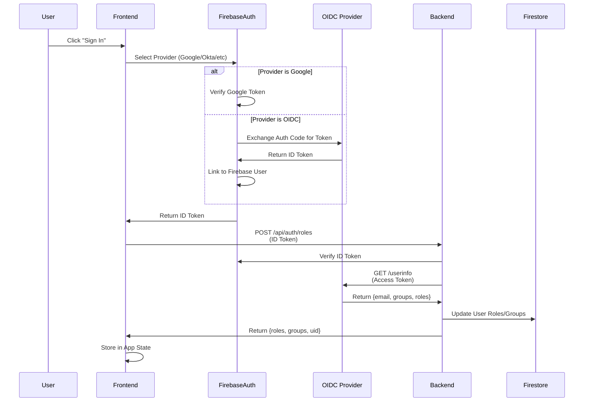
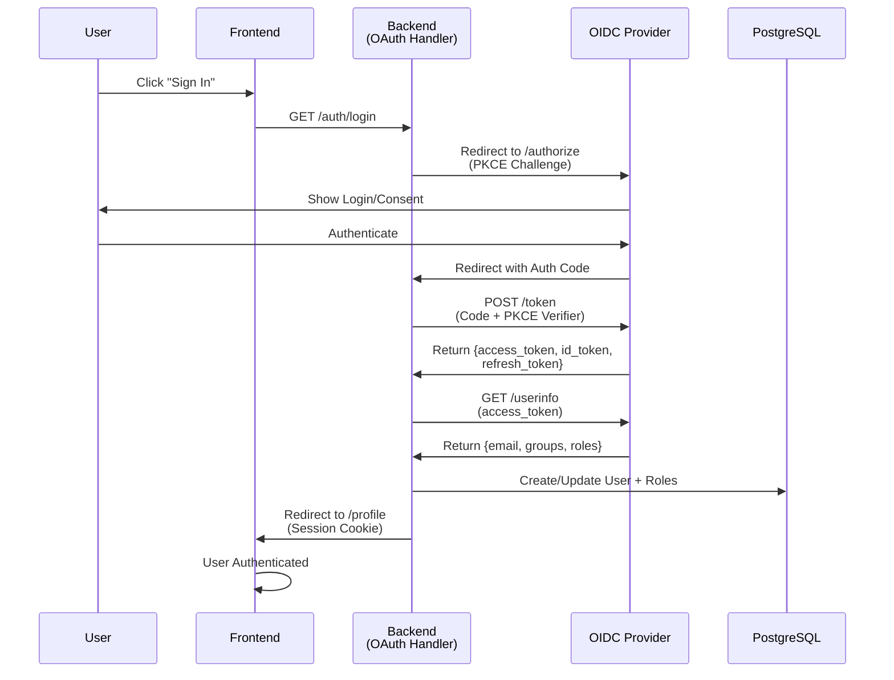

# Authentication Options: Comprehensive Comparison & Implementation Guide

**Document Version**: 1.0
**Last Updated**: December 17, 2025
**Status**: Ready for Implementation
**Audience**: Architects, Full-Stack Developers, DevOps Engineers

---

## Executive Summary

This document compares three authentication approaches for Creative Studio to support flexible identity providers while maintaining role/group-based access control:

1. **Current Implementation**: Firebase Authentication (Google Sign-In)
2. **Option A**: Firebase + OIDC Fallback (Okta, Entra ID, Keycloak)
3. **Option B**: OAuth 2.0 with PKCE (Native OIDC implementation without Firebase)

**Recommendation**: Option A (Firebase + OIDC Fallback) provides the best balance of minimal code changes, gradual migration path, and enterprise capability to retrieve user roles/groups.

---

## Table of Contents

1. [Current State Analysis](#current-state-analysis)
2. [Architecture Comparison](#architecture-comparison)
3. [Role/Group Retrieval Mechanisms](#roleggroup-retrieval-mechanisms)
4. [Implementation Details](#implementation-details)
5. [Effort Estimation & Timeline](#effort-estimation--timeline)
6. [Decision Matrix](#decision-matrix)
7. [Recommended Approach](#recommended-approach)
8. [Migration Roadmap](#migration-roadmap)

---

## Current State Analysis

### Existing Implementation

**Provider**: Firebase Authentication (Google Sign-In only)
**Backend Auth**: OAuth2 Bearer token with Firebase Admin SDK verification
**User Provisioning**: Just-In-Time (JIT) on first login
**Role Storage**: Firebase Custom Claims + Firestore documents
**Group Support**: ❌ Not available

**Architecture**:
```
┌─────────────────────────────────────────────────────────────────┐
│                     Current Firebase Flow                        │
├─────────────────────────────────────────────────────────────────┤
│                                                                  │
│  User → Google OAuth → Firebase Auth → ID Token (JWT)           │
│                            ↓                                     │
│                    Firebase Admin SDK                            │
│                  (Backend Token Verification)                    │
│                            ↓                                     │
│        Firestore Database (User Roles/Custom Claims)            │
│                            ↓                                     │
│                    Protected Endpoints                           │
│                                                                  │
└─────────────────────────────────────────────────────────────────┘
```

**Limitations**:
- ❌ Only Google Sign-In supported
- ❌ Cannot retrieve user groups from external sources
- ❌ Manual role assignment via Firestore
- ❌ No SSO support for enterprise directories
- ❌ Limited fallback mechanism

---

## Architecture Comparison

### Option 1: Firebase + OIDC Fallback (Recommended)

**Overview**: Keep Firebase as primary auth, add OIDC providers (Okta, Entra ID, Keycloak) as fallbacks.

```
┌─────────────────────────────────────────────────────────────────┐
│         Firebase + OIDC Fallback Architecture                   │
├─────────────────────────────────────────────────────────────────┤
│                                                                  │
│  ┌─────────────────┐  ┌──────────────────┐                      │
│  │   Google OAuth  │  │  OIDC Provider   │                      │
│  │ (Primary Auth)  │  │  (Okta/Entra/KC) │                      │
│  └────────┬────────┘  └────────┬─────────┘                      │
│           │                    │                                │
│           └────────┬───────────┘                                │
│                    ▼                                            │
│         ┌──────────────────────┐                               │
│         │ Firebase Console     │                               │
│         │ (Unified Auth)       │                               │
│         └────────┬─────────────┘                               │
│                  ▼                                             │
│         ┌──────────────────────┐                               │
│         │  Firebase Auth SDK   │                               │
│         │  (Frontend)          │                               │
│         └────────┬─────────────┘                               │
│                  ▼                                             │
│     ┌────────────────────────┐                                │
│     │   ID Token (JWT)       │                                │
│     │ + OIDC Provider Token  │                                │
│     └────────┬───────────────┘                                │
│              ▼                                                │
│    ┌───────────────────────────────────┐                      │
│    │      Backend (OAuth2 Bearer)      │                      │
│    │                                   │                      │
│    │ 1. Verify Firebase ID Token       │                      │
│    │ 2. Get User ID/Email              │                      │
│    │ 3. Call OIDC /userinfo endpoint   │                      │
│    │ 4. Extract roles/groups from JWT  │                      │
│    │ 5. Update Firestore with roles    │                      │
│    └────────┬────────────────────────┘                        │
│             ▼                                                 │
│    ┌──────────────────────┐                                   │
│    │   Firestore DB       │                                   │
│    │ (Roles + Groups)     │                                   │
│    └──────────────────────┘                                   │
│                                                              │
└─────────────────────────────────────────────────────────────────┘
```

**Flow Details**:



**Advantages**:
- ✅ Minimal changes to existing Firebase setup
- ✅ Gradual migration path (start with Google, add OIDC later)
- ✅ Firebase handles multiple identity providers
- ✅ Can retrieve groups from OIDC provider
- ✅ Backward compatible with current code
- ✅ Automatic user provisioning through Firebase
- ✅ Native Firebase security rules support

**Disadvantages**:
- ⚠️ Firebase adds abstraction layer
- ⚠️ Group retrieval requires calling OIDC /userinfo endpoint
- ⚠️ Firebase custom claims need manual sync with OIDC data
- ⚠️ Potential token validation complexity

---

### Option 2: Pure OAuth 2.0 with PKCE

**Overview**: Remove Firebase entirely, implement native OAuth 2.0 with PKCE directly.

```
┌─────────────────────────────────────────────────────────────────┐
│        OAuth 2.0 with PKCE Architecture                         │
├─────────────────────────────────────────────────────────────────┤
│                                                                  │
│  ┌─────────────────┐  ┌──────────────────┐                      │
│  │   Google OAuth  │  │  OIDC Provider   │                      │
│  │                 │  │  (Okta/Entra/KC) │                      │
│  └────────┬────────┘  └────────┬─────────┘                      │
│           │                    │                                │
│           └────────┬───────────┘                                │
│                    ▼                                            │
│      ┌──────────────────────────┐                              │
│      │   Backend OAuth Service  │                              │
│      │   (Session Management)   │                              │
│      │                          │                              │
│      │ • Validate Auth Code     │                              │
│      │ • Exchange for Tokens    │                              │
│      │ • Store in Session       │                              │
│      └────────┬─────────────────┘                              │
│               ▼                                                │
│        ┌──────────────────┐                                    │
│        │  Session Storage │                                    │
│        │  (Access Token,  │                                    │
│        │   Refresh Token, │                                    │
│        │   User Info)     │                                    │
│        └────────┬─────────┘                                    │
│                 ▼                                              │
│    ┌────────────────────────┐                                 │
│    │  Protected Endpoints   │                                 │
│    │                        │                                 │
│    │ 1. Check Session       │                                 │
│    │ 2. Extract User Info   │                                 │
│    │ 3. Check Roles/Groups  │                                 │
│    │ 4. Execute Request     │                                 │
│    └────────┬───────────────┘                                 │
│             ▼                                                 │
│    ┌──────────────────────┐                                   │
│    │   PostgreSQL DB      │                                   │
│    │ (Users + Roles)      │                                   │
│    └──────────────────────┘                                   │
│                                                              │
└─────────────────────────────────────────────────────────────────┘
```

**Flow Details**:



**Advantages**:
- ✅ Direct control over authentication flow
- ✅ No Firebase dependency
- ✅ Native support for any OIDC provider
- ✅ Full access to user groups from day one
- ✅ Server-side session management (more control)
- ✅ Better for enterprise deployments
- ✅ PKCE protection built-in

**Disadvantages**:
- ❌ Requires complete rewrite of frontend auth
- ❌ Rewrite of backend auth mechanism
- ❌ Cannot use Firebase security rules
- ❌ Must maintain session management
- ❌ No automatic token refresh handling on frontend
- ❌ Higher complexity for role sync
- ❌ Requires database for user management

---

## Role/Group Retrieval Mechanisms

### Challenge: Why Groups Matter

Current Creative Studio role system:
- System-level roles: USER, CREATOR, ADMIN
- Workspace-level roles: VIEWER, EDITOR, ADMIN, OWNER

External OIDC providers (Okta, Entra ID) already maintain user groups in their directory. To leverage existing organizational structure:

**Goal**: Automatically map external groups → Creative Studio roles

### Mechanism 1: Firebase + OIDC (Recommended)

**Step 1: Retrieve Groups from OIDC Provider**

```python
# backend/src/auth/oidc_groups.py
async def get_user_groups_from_oidc(access_token: str, oidc_issuer: str):
    """
    Fetch user groups from OIDC provider's userinfo endpoint

    Different providers store groups differently:
    - Okta: groups in ID token or separate /groups endpoint
    - Azure AD/Entra: groups in id_token as claim
    - Keycloak: groups in access_token or separate query
    """

    # Discover userinfo endpoint from .well-known/openid-configuration
    discovery_url = f"{oidc_issuer}/.well-known/openid-configuration"
    config = await fetch_and_cache(discovery_url)
    userinfo_endpoint = config['userinfo_endpoint']

    # Call /userinfo with access token
    response = await http_client.get(
        userinfo_endpoint,
        headers={'Authorization': f'Bearer {access_token}'}
    )

    user_info = await response.json()

    # Extract groups (varies by provider)
    groups = user_info.get('groups', [])  # Azure AD
    groups = groups or user_info.get('group_ids', [])  # Okta
    groups = groups or get_groups_from_jwt_claims(user_info)  # Keycloak

    return {
        'email': user_info['email'],
        'name': user_info.get('name'),
        'groups': groups,
        'sub': user_info['sub']
    }
```

**Step 2: Map Groups to Roles**

```python
# backend/src/auth/group_role_mapping.py
from enum import Enum

class GroupRoleMapping:
    """Map external groups to Creative Studio roles"""

    MAPPING = {
        'okta_admins': ['admin'],
        'okta_creators': ['creator'],
        'okta_users': ['user'],
        'entra_admins': ['admin'],
        'entra_design_team': ['creator'],
        'keycloak_platform_admin': ['admin'],
    }

    @staticmethod
    def get_roles_from_groups(groups: List[str]) -> List[str]:
        """Convert group memberships to Creative Studio roles"""
        roles = set()

        for group in groups:
            if group in GroupRoleMapping.MAPPING:
                roles.update(GroupRoleMapping.MAPPING[group])

        # Default to USER if no matching groups
        if not roles:
            roles.add('user')

        return list(roles)

async def sync_user_roles_from_groups(
    user_id: str,
    groups: List[str],
    firebase_admin_service
):
    """
    Sync roles from external groups to Firebase custom claims
    Called after successful authentication
    """

    # Convert groups to roles
    roles = GroupRoleMapping.get_roles_from_groups(groups)

    # Set Firebase custom claims (so roles appear in ID token)
    firebase_admin_service.set_custom_claims(user_id, {
        'roles': roles,
        'groups': groups,
        'synced_at': datetime.utcnow().isoformat(),
    })

    # Also update Firestore for quick lookup
    firestore.update_document('users', user_id, {
        'roles': roles,
        'groups': groups,
        'role_source': 'external_oidc',
        'last_sync': datetime.utcnow().isoformat(),
    })
```

**Step 3: Backend Verification**

```python
# backend/src/auth/auth_guard.py
async def get_current_user(
    credentials: HTTPAuthCredentials = Depends(security),
    user_service: UserService = Depends(),
):
    """
    Enhanced auth guard that handles both Firebase and OIDC
    """

    token = credentials.credentials

    try:
        # Step 1: Verify Firebase ID token
        decoded_token = firebase_admin_service.verify_token(token)

        # Step 2: Get user roles from custom claims
        # (already synced from OIDC groups)
        custom_claims = decoded_token.get('custom_claims', {})
        roles = custom_claims.get('roles', ['user'])
        groups = custom_claims.get('groups', [])

        # Step 3: Create user context
        user = await user_service.get_or_create_user(
            uid=decoded_token['uid'],
            email=decoded_token['email'],
            roles=roles,
            groups=groups,
        )

        return user

    except ValueError as e:
        raise HTTPException(
            status_code=401,
            detail=f'Invalid token: {str(e)}'
        )
```

**Advantages**:
- Roles in ID token (fast access, no DB lookup)
- Roles sync at login time (always current)
- Backward compatible with current system
- Works with any OIDC provider

**Challenges**:
- Groups must be fetched in separate API call
- Role sync needs scheduled refresh (in case groups change)
- Provider-specific group claim paths

---

### Mechanism 2: Pure OAuth 2.0 with PKCE

**Step 1: Extract Groups from ID Token**

```javascript
// OAuth 2.0 with PKCE extracts groups directly from ID token claims
// Depends on provider configuration to include groups in token

// For Okta:
const idToken = jwt_decode(id_token);
console.log(idToken.groups); // Array of group names

// For Azure AD/Entra:
const idToken = jwt_decode(id_token);
console.log(idToken['groups']); // Array of group OIDs

// For Keycloak:
const idToken = jwt_decode(id_token);
const groups = idToken.resource_access?.['client-id']?.roles || [];
```

**Step 2: Backend Role Sync**

```javascript
// routes/api.js
router.post('/sync-roles', async (req, res) => {
    const { userinfo } = req.session;
    const groups = userinfo.groups || [];

    // Map groups to roles
    const roles = mapGroupsToRoles(groups);

    // Update user in database
    await db.query(
        'UPDATE users SET roles = $1, groups = $2 WHERE email = $3',
        [roles, groups, userinfo.email]
    );

    res.json({ success: true, roles, groups });
});
```

**Advantages**:
- Groups directly in ID token
- No additional API calls needed
- Faster processing

**Disadvantages**:
- Requires OIDC provider to include groups in token
- May not work with all providers
- No fallback if groups missing

---

## Implementation Details

### Option A: Firebase + OIDC Fallback (Recommended)

#### Phase 1: Setup Firebase OIDC Provider

**Location**: Firebase Console → Authentication → Sign-in Method

**Steps**:

1. **Add OIDC Provider**:
   - Go to Firebase Console
   - Authentication → Sign-in method
   - Click "Add new provider" → OIDC
   - Configure:
     - Provider ID: `oidc.okta` (or your provider)
     - Client ID: From your OIDC provider
     - Client Secret: From your OIDC provider
     - Authorization endpoint: From provider's .well-known config
     - Token endpoint: From provider's .well-known config

2. **Update Frontend Auth Service**:

```typescript
// frontend/src/app/common/services/auth.service.ts

export class AuthService {
    async signInWithOIDC(providerId: string): Promise<void> {
        const provider = new OAuthProvider(providerId);

        // Request groups scope (provider-specific)
        provider.addScope('groups');
        provider.addScope('email');
        provider.addScope('profile');

        try {
            const result = await signInWithPopup(this.auth, provider);

            // Get ID token with roles/groups in custom claims
            const idToken = await result.user.getIdToken(true);

            // Fetch and sync roles from OIDC provider
            await this.syncUserRolesFromOIDC(idToken);

            this.router.navigate(['/dashboard']);
        } catch (error) {
            console.error('OIDC sign-in error:', error);
            throw error;
        }
    }

    private async syncUserRolesFromOIDC(idToken: string): Promise<void> {
        const response = await fetch('/api/auth/sync-roles', {
            method: 'POST',
            headers: { 'Content-Type': 'application/json' },
            body: JSON.stringify({ idToken })
        });

        const data = await response.json();
        console.log('Roles synced:', data.roles);
    }
}
```

3. **Backend Role Sync Endpoint**:

```python
# backend/src/routes/auth_controller.py

@router.post('/api/auth/sync-roles')
async def sync_roles_from_oidc(
    request: SyncRolesRequest,
    current_user: dict = Depends(get_current_user),
):
    """
    Sync user roles from OIDC provider to Firebase custom claims
    Called after OIDC authentication
    """

    # Get user info from OIDC provider
    oidc_service = OIDCService()
    user_groups = await oidc_service.get_user_groups(
        current_user['uid'],
        request.oidc_issuer
    )

    # Convert groups to roles
    roles = GroupRoleMapping.get_roles_from_groups(user_groups)

    # Set Firebase custom claims (for ID token)
    firebase_admin_service.set_custom_claims(
        current_user['uid'],
        {
            'roles': roles,
            'groups': user_groups,
            'synced_at': datetime.utcnow().isoformat(),
        }
    )

    # Update Firestore
    firestore_service.update_document('users', current_user['uid'], {
        'roles': roles,
        'groups': user_groups,
        'role_source': 'oidc_sync',
    })

    return {
        'success': True,
        'roles': roles,
        'groups': user_groups,
    }
```

#### Phase 2: Support Multiple Providers

**UI Enhancement**:

```typescript
// frontend/src/app/auth/login.component.ts

export class LoginComponent {
    providers = [
        { id: 'google.com', name: 'Google', icon: 'google' },
        { id: 'oidc.okta', name: 'Okta SSO', icon: 'okta' },
        { id: 'oidc.entra', name: 'Microsoft Entra ID', icon: 'microsoft' },
    ];

    async signInWithProvider(providerId: string) {
        if (providerId === 'google.com') {
            await this.authService.signInWithGoogle();
        } else {
            await this.authService.signInWithOIDC(providerId);
        }
    }
}
```

#### Phase 3: Role Refresh Strategy

**For when external groups change**:

```python
# backend/src/routes/auth_controller.py

@router.post('/api/auth/refresh-roles')
async def refresh_roles(
    current_user: dict = Depends(get_current_user),
):
    """
    Manually refresh user roles from OIDC provider
    Can be called periodically or on-demand
    """

    user_id = current_user['uid']
    user_email = current_user['email']

    # Detect which provider user signed in with
    firebase_user = firebase_admin_service.get_user(user_id)
    provider = firebase_user.provider_data[0].provider_id

    if provider.startswith('oidc.'):
        # Fetch fresh groups from OIDC provider
        oidc_service = OIDCService()
        user_groups = await oidc_service.get_user_groups(user_id, provider)

        # Convert to roles
        roles = GroupRoleMapping.get_roles_from_groups(user_groups)

        # Update Firebase custom claims
        firebase_admin_service.set_custom_claims(user_id, {
            'roles': roles,
            'groups': user_groups,
            'last_refreshed': datetime.utcnow().isoformat(),
        })

        return {
            'success': True,
            'roles': roles,
            'groups': user_groups,
            'refreshed_at': datetime.utcnow().isoformat(),
        }
    else:
        # Google provider - no groups to fetch
        return {
            'success': True,
            'message': 'Google provider does not support groups',
        }
```

---

### Option B: Pure OAuth 2.0 with PKCE

#### Phase 1: Backend OAuth Handler

```javascript
// auth/index.js (from oauth_auth_pkce example)

const express = require('express');
const crypto = require('crypto');

async function createAuthModule(config, appBaseUrl) {
    const router = express.Router();

    // Discover OIDC endpoints
    const discoveryUrl = `${config.issuerUrl}/.well-known/openid-configuration`;
    const openIdConfig = await fetch(discoveryUrl).then(r => r.json());

    const {
        authorization_endpoint,
        token_endpoint,
        userinfo_endpoint,
        end_session_endpoint,
    } = openIdConfig;

    // Login endpoint - initiate OAuth flow
    router.get('/login', (req, res) => {
        const codeVerifier = crypto.randomBytes(32).toString('hex');
        const codeChallenge = createCodeChallenge(codeVerifier);

        req.session.pkceVerifier = codeVerifier;
        req.session.oauthState = crypto.randomBytes(16).toString('hex');

        const authUrl = `${authorization_endpoint}?` +
            `response_type=code` +
            `&client_id=${config.clientId}` +
            `&redirect_uri=${encodeURIComponent(appBaseUrl + '/callback')}` +
            `&state=${req.session.oauthState}` +
            `&scope=${encodeURIComponent('openid profile email groups')}` +
            `&code_challenge=${codeChallenge}` +
            `&code_challenge_method=S256`;

        res.redirect(authUrl);
    });

    // Callback handler
    router.get('/callback', async (req, res) => {
        const { code, state } = req.query;

        // Validate state
        if (state !== req.session.oauthState) {
            return res.status(400).send('CSRF attack detected');
        }

        try {
            // Exchange code for tokens
            const tokenResponse = await fetch(token_endpoint, {
                method: 'POST',
                headers: { 'Content-Type': 'application/x-www-form-urlencoded' },
                body: new URLSearchParams({
                    grant_type: 'authorization_code',
                    code,
                    client_id: config.clientId,
                    client_secret: config.clientSecret,
                    redirect_uri: appBaseUrl + '/callback',
                    code_verifier: req.session.pkceVerifier,
                })
            });

            const tokens = await tokenResponse.json();
            req.session.tokens = tokens;

            // Fetch user info (includes groups)
            const userInfoResponse = await fetch(userinfo_endpoint, {
                headers: { 'Authorization': `Bearer ${tokens.access_token}` }
            });

            const userInfo = await userInfoResponse.json();
            req.session.userinfo = userInfo;

            // Extract roles from groups
            const groups = userInfo.groups || [];
            const roles = mapGroupsToRoles(groups);
            req.session.roles = roles;

            res.redirect('/profile');

        } catch (error) {
            console.error('OAuth error:', error);
            res.status(500).send('Authentication failed');
        }
    });

    return { authRouter: router };
}
```

#### Phase 2: Frontend Integration

```html
<!-- frontend/profile.html -->
<div class="profile">
    <h1>Welcome, <%= userinfo.name %></h1>

    <div class="user-info">
        <p>Email: <%= userinfo.email %></p>
        <p>Groups: <%= userinfo.groups.join(', ') %></p>
        <p>Roles: <%= roles.join(', ') %></p>
    </div>

    <form action="/auth/logout" method="POST">
        <button type="submit">Logout</button>
    </form>
</div>
```

#### Phase 3: Database Storage

```sql
-- Schema for user management
CREATE TABLE users (
    id SERIAL PRIMARY KEY,
    email VARCHAR UNIQUE NOT NULL,
    name VARCHAR,
    sub VARCHAR UNIQUE NOT NULL,  -- OIDC subject ID
    groups TEXT[] NOT NULL,
    roles TEXT[] NOT NULL,
    created_at TIMESTAMP DEFAULT CURRENT_TIMESTAMP,
    updated_at TIMESTAMP DEFAULT CURRENT_TIMESTAMP
);

CREATE TABLE user_groups (
    id SERIAL PRIMARY KEY,
    user_id INT REFERENCES users(id),
    group_name VARCHAR NOT NULL,
    group_id VARCHAR,  -- External group ID from OIDC provider
    PRIMARY KEY (user_id, group_name)
);
```

---

## Effort Estimation & Timeline

### Option A: Firebase + OIDC Fallback

| Task | Effort | Days | Notes |
|------|--------|------|-------|
| **Setup Firebase OIDC Providers** | Medium | 2 | Configure Okta/Entra in Firebase Console |
| **Update Frontend Auth Service** | Medium | 3 | Add provider selection, OIDC sign-in |
| **Build Backend Role Sync** | Medium | 4 | OIDC discovery, group fetching, mapping |
| **Create Group↔Role Mapping** | Low | 2 | Configuration-driven mapping |
| **Add Role Refresh Mechanism** | Low | 2 | Scheduled or on-demand refresh |
| **Testing & QA** | High | 5 | Multiple providers, edge cases |
| **Documentation & Migration Guide** | Medium | 3 | Admin guide, user guide, troubleshooting |
| **Deployment & Monitoring** | Medium | 3 | Staging, production, alerts |
| **TOTAL** | | **24 days** | ~1 month |

**Critical Path**: Firebase setup (2) → Backend sync (4) → Testing (5) → Deploy (3) = 14 days minimum

### Option B: Pure OAuth 2.0 with PKCE

| Task | Effort | Days | Notes |
|------|--------|------|-------|
| **Redesign Frontend Auth Flow** | High | 8 | New provider UI, OAuth orchestration |
| **Build Backend OAuth Handler** | High | 8 | Token exchange, session management, token refresh |
| **Remove Firebase Dependencies** | High | 6 | Frontend + Backend code changes |
| **Implement Session Management** | High | 5 | Secure session storage, CSRF protection |
| **Database Schema & Migrations** | Medium | 3 | User + group tables, indexes |
| **Role Management System** | Medium | 4 | Sync groups to roles, assignment logic |
| **Update All Protected Endpoints** | High | 6 | Replace Firebase dependency with session checks |
| **Token Refresh Strategy** | Medium | 4 | Background refresh, expiration handling |
| **Testing & QA** | Critical | 8 | Higher complexity, more edge cases |
| **Documentation** | Medium | 3 | OAuth flow, setup guide, troubleshooting |
| **Deployment & Monitoring** | Medium | 3 | Gradual rollout, comprehensive monitoring |
| **TOTAL** | | **58 days** | ~2.5 months |

**Critical Path**: Remove Firebase (6) → Build OAuth handler (8) → Update endpoints (6) → Testing (8) = 28 days minimum

---

## Decision Matrix

| Criteria | Firebase + OIDC | Pure OAuth 2.0 |
|----------|-----------------|----------------|
| **Implementation Time** | 24 days | 58 days |
| **Code Changes** | 20% | 80% |
| **Risk Level** | Low | High |
| **Backward Compatibility** | ✅ Yes | ❌ No |
| **Firebase Features Lost** | None | All (rules, hosting, realtime DB) |
| **Group Retrieval** | ✅ Supported | ✅ Supported |
| **Provider Flexibility** | ✅ High | ✅ High |
| **Enterprise Features** | ✅ Yes | ✅ Yes |
| **Token Management** | ✅ Auto (Firebase) | ⚠️ Manual |
| **Session Management Complexity** | Low | High |
| **Security Rules Support** | ✅ Yes | ❌ No |
| **Development Team Effort** | Medium | Very High |
| **Ongoing Maintenance** | Low | High |
| **Learning Curve** | Shallow | Steep |

---

## Recommended Approach

### **Option A: Firebase + OIDC Fallback**

**Why This Wins**:

1. **Minimal Disruption**: Keep Firebase, add OIDC as fallback
2. **Gradual Migration**: Deploy to production in weeks, not months
3. **Risk Mitigation**: Fallback to Google Sign-In if OIDC fails
4. **Team Productivity**: Current team knowledge applies
5. **Future Flexibility**: Easy to migrate fully later if needed
6. **Enterprise Ready**: Full group/role support via OIDC

**Implementation Strategy**:

### Phase 1: Preparation (Week 1)
- [ ] Get OIDC provider credentials (Okta/Entra/Keycloak)
- [ ] Set up test OIDC instance
- [ ] Document group structure in source system
- [ ] Design group→role mapping

### Phase 2: Backend (Week 1-2)
- [ ] Build OIDC discovery service
- [ ] Implement group fetching from OIDC /userinfo
- [ ] Create group↔role mapping service
- [ ] Build role sync endpoint
- [ ] Add role refresh mechanism

### Phase 3: Frontend (Week 2-3)
- [ ] Update auth service for OIDC support
- [ ] Build provider selection UI
- [ ] Add OIDC sign-in flow
- [ ] Update token handling for multiple providers

### Phase 4: Testing (Week 3)
- [ ] Unit tests for group mapping
- [ ] Integration tests with test OIDC instance
- [ ] E2E tests (all provider combinations)
- [ ] Security review

### Phase 5: Deployment (Week 4)
- [ ] Staging deployment
- [ ] Canary to 10% users
- [ ] Gradual rollout to 100%
- [ ] Monitoring & alerting setup

---

## Migration Roadmap

### Phase 0: Current State (Today)
```
┌─────────────────────┐
│  Google Sign-In     │
│  + Firebase Auth    │
│  + Manual Roles     │
│  ❌ No Groups       │
└─────────────────────┘
```

### Phase 1: Add OIDC Support
```
┌─────────────────────┐
│  Google Sign-In     │
│  + Okta SSO         │ ← NEW
│  + Firebase Auth    │
│  + Auto Roles       │ ← NEW (from groups)
│  ✅ Groups Support  │ ← NEW
└─────────────────────┘
```

### Phase 2: Add Entra ID Support (Optional)
```
┌──────────────────────────┐
│  Google Sign-In          │
│  + Okta SSO              │
│  + Entra ID SSO          │ ← NEW
│  + Firebase Auth         │
│  + Auto Roles            │
│  + Groups Support        │
│  + Azure AD Sync         │ ← NEW
└──────────────────────────┘
```

### Phase 3: Full OIDC Ecosystem (Future)
```
┌──────────────────────────┐
│  Any OIDC Provider       │
│  + Custom Provider Sync  │ ← NEW
│  + Advanced Group Mapping│ ← NEW
│  + Federated Identity    │ ← NEW
│  + SSO Dashboard         │ ← NEW
└──────────────────────────┘
```

---

## Key Implementation Files

### Files to Create/Modify

**Frontend**:
- `src/app/common/services/auth.service.ts` - Add OIDC support
- `src/app/auth/login.component.ts` - Provider selection UI
- `src/app/auth/login.component.html` - Provider buttons
- `src/app/auth/login.component.scss` - Provider styling

**Backend**:
- `src/auth/oidc_service.py` - OIDC discovery & user info
- `src/auth/group_role_mapping.py` - Group to role conversion
- `src/routes/auth_controller.py` - Sync roles endpoint
- `src/tests/auth_test.py` - Auth flow tests

**Configuration**:
- `backend/.env.example` - New OIDC provider vars
- `frontend/src/environments/*.ts` - Provider IDs
- `docs/OIDC_SETUP_GUIDE.md` - Admin setup guide

---

## Conclusion

**Option A (Firebase + OIDC Fallback)** provides the best path forward:
- ✅ **24-day timeline** (vs 58 days)
- ✅ **Minimal code changes** (20% vs 80%)
- ✅ **Full group support** via OIDC provider
- ✅ **Zero risk to existing Google SSO**
- ✅ **Enterprise-ready** on day one

**Next Steps**:
1. Get OIDC provider credentials (Okta/Entra)
2. Start Phase 1: Backend OIDC service
3. Plan group mapping with ops team
4. Begin implementation sprint

---

**Document Prepared For**: Architecture Review & Approval
**Requires**:
- [ ] OIDC provider setup (Okta/Entra/Keycloak)
- [ ] Group structure documentation
- [ ] Role mapping approval from product team
