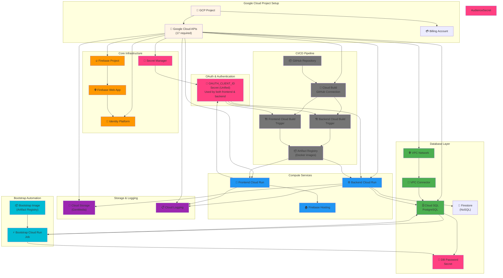
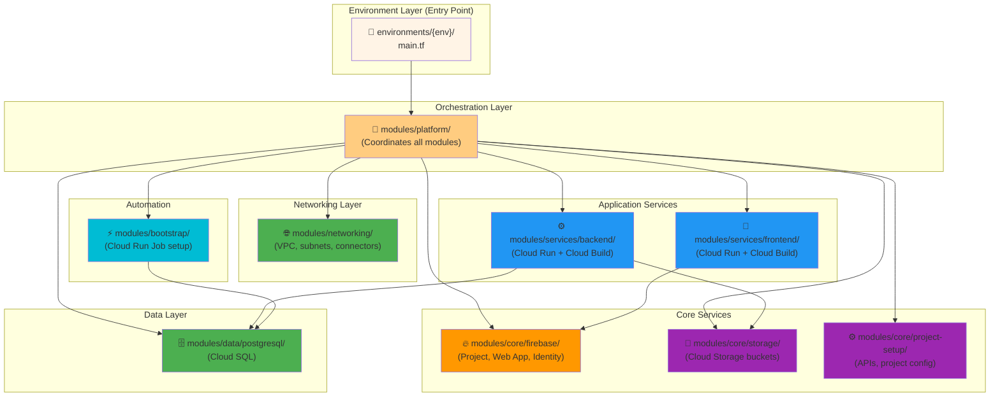
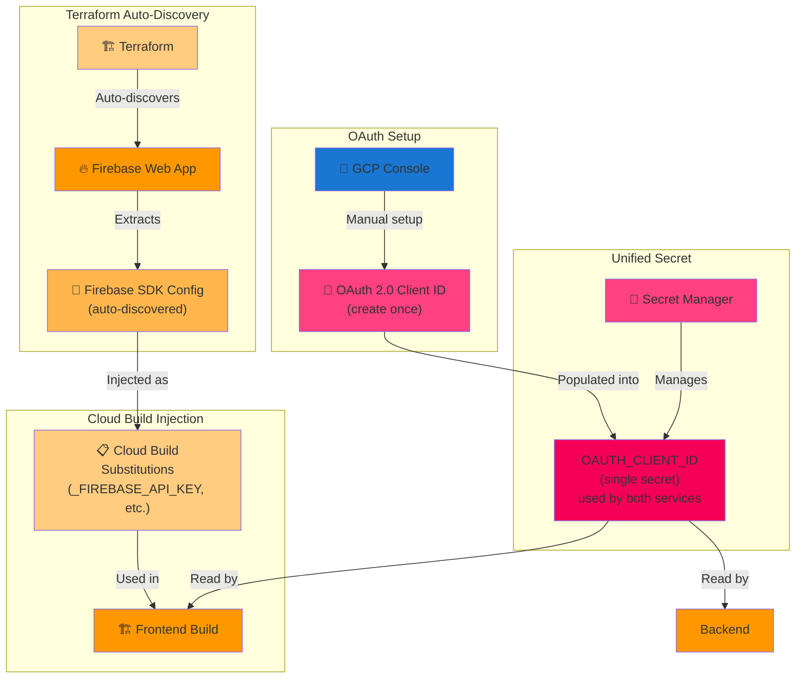
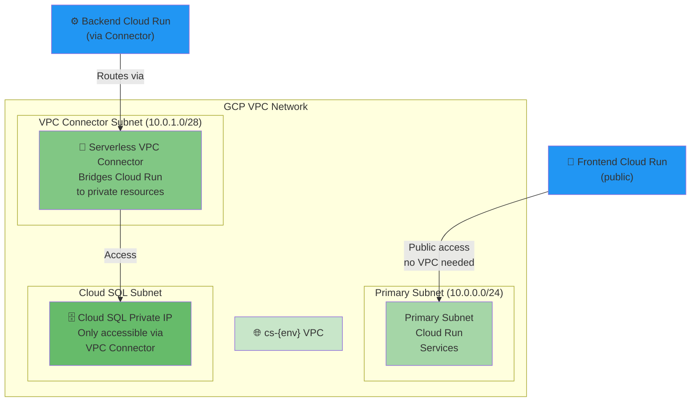

# Creative Studio Infrastructure Architecture

## Overview

This document describes the complete Google Cloud Platform infrastructure for Creative Studio, including all GCP resources, their interconnections, and deployment architecture.

The infrastructure is organized as a **modular Terraform deployment** that:
- Deploys Cloud Run microservices (backend & frontend)
- Manages Cloud SQL PostgreSQL database (relational data)
- Manages Firestore database (document/NoSQL data)
- Configures Firebase (project, web app, Identity Platform, Hosting)
- Orchestrates CI/CD with Cloud Build
- Implements VPC networking for private Cloud SQL access
- Manages Cloud Storage for media assets
- Automates database bootstrap via Cloud Run Jobs

---

## Complete Resource Dependency Graph



---

## Terraform Module Structure



---

## Cloud Run Service Architecture

```mermaid
graph LR
    subgraph "Backend Service"
        BECR["☁️ Cloud Run<br/>Backend"]
        BESA["🔐 Service Account<br/>(Run)"]
        BETSA["🔐 Service Account<br/>(Trigger)"]
        BECB["🏗️ Cloud Build<br/>Trigger"]
    end

    subgraph "Frontend Service"
        FECR["☁️ Cloud Run<br/>Firebase Hosting"]
        FESA["🔐 Service Account<br/>(Run)"]
        FETSA["🔐 Service Account<br/>(Trigger)"]
        FECB["🏗️ Cloud Build<br/>Trigger"]
    end

    subgraph "Shared Resources"
        AR["📦 Artifact Registry"]
        GitRepo["📦 GitHub Repo"]
        Secrets["🔐 Secret Manager"]
        CloudSQL["🗄️ Cloud SQL"]
        Storage["💾 Cloud Storage"]
    end

    GitRepo -->|Push event| BECB
    BECB -->|Builds & Pushes| AR
    AR -->|Deploys| BECR
    BECR -.->|Impersonates| BESA
    BECB -->|Impersonates| BETSA

    GitRepo -->|Push event| FECB
    FECB -->|Builds & Pushes| AR
    AR -->|Deploys| FECR
    FECR -.->|Impersonates| FESA
    FECB -->|Impersonates| FETSA

    BECR -->|Read/Write| CloudSQL
    BECR -->|Read/Write| Storage
    BECR -->|Read| Secrets
    FECR -->|Read| Secrets

    style BECR fill:#2196f3
    style BESA fill:#1976d2
    style BETSA fill:#1976d2
    style BECB fill:#757575
    style FECR fill:#2196f3
    style FESA fill:#1976d2
    style FETSA fill:#1976d2
    style FECB fill:#757575
    style AR fill:#757575
    style GitRepo fill:#424242
    style Secrets fill:#ff4081
    style CloudSQL fill:#4caf50
    style Storage fill:#9c27b0
```



---

## Secret Management Flow



---

## IAM & Access Control

```mermaid
graph TB
    subgraph "Backend Cloud Run Service Account"
        BESA["🔐 cs-be-{env}-run"]
        BEPERMS["Permissions:<br/>- aiplatform.user<br/>- storage.objectAdmin<br/>- firebase.developAdmin<br/>- iam.serviceAccountTokenCreator<br/>- cloudsql.client"]
    end

    subgraph "Backend Cloud Build Service Account"
        BETSA["🔐 cs-be-{env}-trig"]
        BETS["Permissions:<br/>- logging.logWriter<br/>- artifactregistry.writer<br/>- run.developer<br/>- iam.serviceAccountUser"]
    end

    subgraph "Frontend Cloud Run Service Account"
        FESA["🔐 cs-fe-{env}-run"]
        FEPERMS["Permissions:<br/>- firebasehosting.admin<br/>- secretmanager.secretAccessor"]
    end

    subgraph "Frontend Cloud Build Service Account"
        FETSA["🔐 cs-fe-{env}-trig"]
        FETS["Permissions:<br/>- logging.logWriter<br/>- artifactregistry.writer<br/>- firebasehosting.admin<br/>- iam.serviceAccountUser"]
    end

    subgraph "Bootstrap Cloud Run Job Service Account"
        BOSA["🔐 cs-bootstrap-{env}"]
        BOPERMS["Permissions:<br/>- cloudsql.client<br/>- secretmanager.secretAccessor<br/>- iam.serviceAccountUser"]
    end

    BESA --> BEPERMS
    BETSA --> BETS
    FESA --> FEPERMS
    FETSA --> FETS
    BOSA --> BOPERMS

    style BESA fill:#1976d2
    style BEPERMS fill:#e3f2fd
    style BETSA fill:#1976d2
    style BETS fill:#e3f2fd
    style FESA fill:#1976d2
    style FEPERMS fill:#e3f2fd
    style FETSA fill:#1976d2
    style FETS fill:#e3f2fd
    style BOSA fill:#1976d2
    style BOPERMS fill:#e3f2fd
```



---

## Network Architecture (VPC Mode)



---

## Deployment Flow

```mermaid
graph LR
    Dev["👤 Developer"]
    Git["📦 GitHub"]
    CB["🏗️ Cloud Build"]
    AR["📦 Artifact Registry"]
    CR["☁️ Cloud Run"]

    Dev -->|Push code| Git
    Git -->|Webhook| CB
    CB -->|Build image| CB
    CB -->|Push image| AR
    CB -->|Deploy service| CR

    style Dev fill:#fff4e6
    style Git fill:#424242
    style CB fill:#757575
    style AR fill:#757575
    style CR fill:#2196f3
```



---

## Key Resources by Function

### Authentication & Authorization
- **Firebase Identity Platform** - User authentication
- **OAuth 2.0 Client ID** - Google Sign-In
- **Service Accounts** - Machine-to-machine access

### Database
- **Cloud SQL (PostgreSQL)** - Primary database
- **VPC Connector** - Private connectivity
- **Cloud SQL Proxy** - Secure connections from Cloud Run

### Application Deployment
- **Cloud Run (Backend)** - API service
- **Cloud Run (Frontend)** - Web application
- **Firebase Hosting** - Frontend distribution

### CI/CD
- **Cloud Build** - Build automation
- **Artifact Registry** - Container image storage
- **GitHub Connection** - Repository integration

### Secrets & Configuration
- **Secret Manager** - Unified OAuth credential (`OAUTH_CLIENT_ID`) used by both frontend and backend
- **Cloud Build Substitutions** - Firebase SDK config injection
- **Terraform Secret Mapping** - Cloud Run environment variable to Secret Manager secret mapping

### Monitoring & Logging
- **Cloud Logging** - Application logs
- **Cloud Monitoring** - Metrics and alerts (optional)

### Storage
- **Cloud Storage** - Media assets (GenMedia bucket)

---

## Configuration Management

### Secrets Management Architecture

**Unified OAuth Credential (`OAUTH_CLIENT_ID`):**
- Single secret stored in Secret Manager
- Created and managed by Terraform `core/secrets` module
- Accessible to:
  - Frontend Cloud Build (injects as `GOOGLE_CLIENT_ID` into build)
  - Backend Cloud Build (validates during build)
  - Backend Cloud Run (mounts as `GOOGLE_TOKEN_AUDIENCE` at runtime)
- **Key Design:** Same secret value, different environment variable names per service
  - Frontend app reads: `environment.GOOGLE_CLIENT_ID`
  - Backend app reads: `config_service.GOOGLE_TOKEN_AUDIENCE`
  - Terraform handles the mapping via `secret_key_ref` in Cloud Run configuration

**Service Account Permissions:**
- `cs-fe-{env}-trig` - Cloud Build trigger for frontend (reads OAUTH_CLIENT_ID)
- `cs-be-{env}-trig` - Cloud Build trigger for backend (reads OAUTH_CLIENT_ID)
- `cs-be-{env}-run` - Cloud Run runtime for backend (reads OAUTH_CLIENT_ID)

### Environment Variables by Service

**Backend Cloud Run:**
- `DB_HOST` - Cloud SQL private IP (via VPC)
- `DB_USER` - Database user
- `DB_NAME` - Database name
- `GOOGLE_TOKEN_AUDIENCE` - OAuth Client ID (via Secret Manager secret mapping)
- `CORS_ORIGINS` - Frontend URL (auto-populated)
- `GENMEDIA_BUCKET` - Cloud Storage bucket (auto-populated)
- `SIGNING_SA_EMAIL` - Storage writer service account (auto-populated)
- Custom env vars from `.tfvars`

**Frontend Cloud Build:**
- `GOOGLE_CLIENT_ID` - OAuth Client ID (via `OAUTH_CLIENT_ID` secret)
- `_BACKEND_URL` - Backend API endpoint
- `_FIREBASE_*` - Firebase SDK config (via Cloud Build substitutions)
- Injects into: `environment.prod.ts` configuration file

**Frontend Application (Browser):**
- `GOOGLE_CLIENT_ID` - Injected at build time from secret
- `FIREBASE_API_KEY` - Via Cloud Build substitution
- `FIREBASE_AUTH_DOMAIN` - Via Cloud Build substitution
- `FIREBASE_PROJECT_ID` - Via Cloud Build substitution
- `FIREBASE_STORAGE_BUCKET` - Via Cloud Build substitution
- `FIREBASE_MESSAGING_SENDER_ID` - Via Cloud Build substitution
- `FIREBASE_MEASUREMENT_ID` - Via Cloud Build substitution (optional)
- `BACKEND_URL` - API endpoint

---

## Scaling & Performance

### Cloud Run Scaling
- **Backend**: Min 1, Max 100 instances (configurable)
- **Frontend**: Min 1, Max 100 instances (configurable)
- **Bootstrap Job**: Single execution, can be parallelized

### Database Scaling
- **Cloud SQL**: Configurable machine type and storage
- **VPC Connector**: Shared resource, throughput limits apply
- **Connections**: Cloud Run instances share connection pool

### Storage & Bandwidth
- **Cloud Storage**: Auto-scales, pay per GB
- **Cloud Run**: Pay per CPU-second and request

---

## Disaster Recovery & Backup

### Database
- **Automated backups**: Retention based on billing plan
- **VPC Connector failover**: Automatic if needed
- **Cloud SQL redundancy**: HA configuration available

### Application
- **Cloud Build history**: 90-day retention
- **Container images**: Versioned in Artifact Registry
- **Configuration**: Terraform state in GCS

---

## Security Features

1. **Network Isolation**
   - VPC Connector provides private connectivity for Cloud SQL
   - Frontend is public (via Firebase Hosting)
   - Backend accessible only via Cloud Run

2. **Unified Secret Management**
   - Single `OAUTH_CLIENT_ID` secret for both frontend and backend
   - Centralized secret creation and permission management via `core/secrets` module
   - Terraform handles secret-to-environment-variable mapping (no code changes needed)
   - Firebase SDK config via Cloud Build substitutions (not stored in Secret Manager)
   - Database password as separate Secret Manager secret (auto-generated)
   - Build-time validation catches missing secrets early

3. **Service Account Isolation**
   - Separate run and trigger service accounts per service
   - Minimal IAM permissions (principle of least privilege)
   - Permissions granted at secret creation time (single location)
   - No scattered IAM bindings across multiple modules

4. **Access Control**
   - Cloud Run invoker role for public access
   - Custom audiences for authentication
   - Secret Manager accessor role for secrets (managed centrally)
   - Three service accounts with OAUTH_CLIENT_ID access:
     - Frontend trigger (Cloud Build)
     - Backend trigger (Cloud Build)
     - Backend runtime (Cloud Run)

---

## Module Dependencies Summary

```
google_project_service (17 APIs)
    ↓
├─→ firebase (project, web app, Identity Platform)
├─→ storage (GCS buckets, service accounts)
├─→ networking (VPC, subnets, connectors)
│   └─→ postgresql (Cloud SQL)
├─→ backend_service (creates backend SAs, Cloud Run, Cloud Build)
├─→ frontend_service (creates frontend SAs, Cloud Build, Hosting)
├─→ app_secrets (CREATES: OAUTH_CLIENT_ID secret + IAM bindings)
│   ├─ depends_on: backend_service.trigger_sa, backend_service.run_sa
│   ├─ depends_on: frontend_service.trigger_sa
│   └─ provides: unified secret with multi-SA access
└─→ bootstrap (Cloud Run Job)
```

---

## Recommended Reading

- **[README.md](./README.md)** - Quick start guide and setup
- **[QUICK_START.md](./QUICK_START.md)** - Step-by-step deployment instructions
- **Module READMEs** - Detailed module-specific documentation
  - `modules/platform/README.md`
  - `modules/services/backend/README.md`
  - `modules/services/frontend/README.md`

