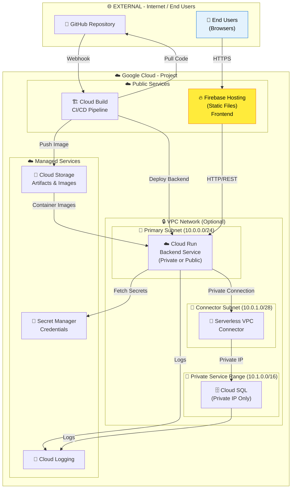
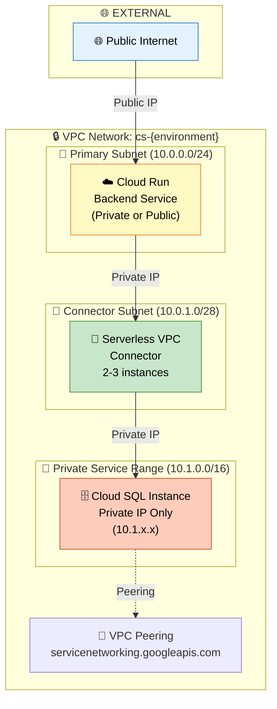
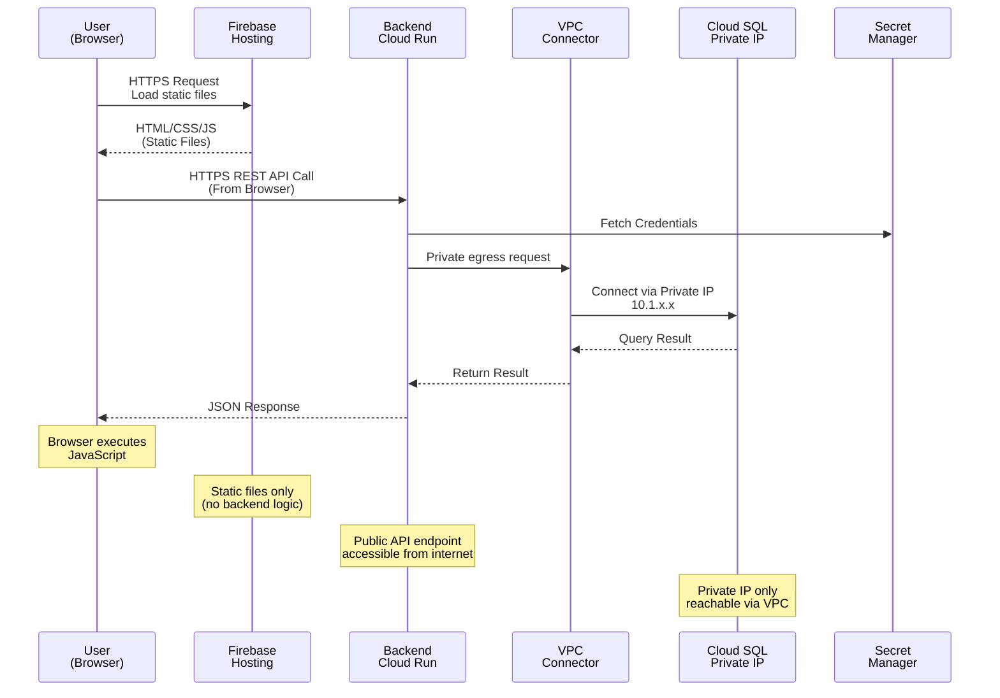
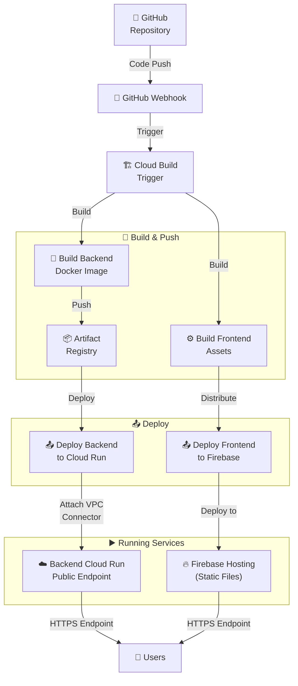
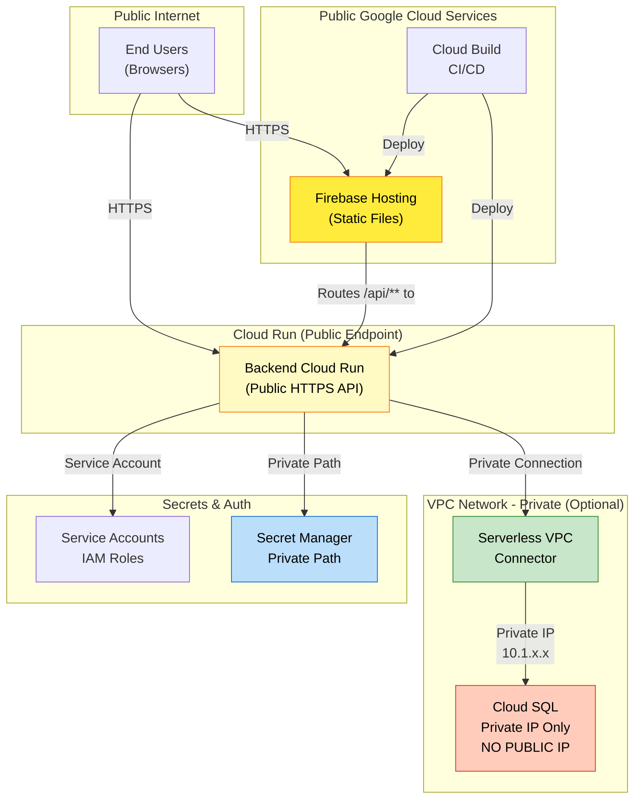
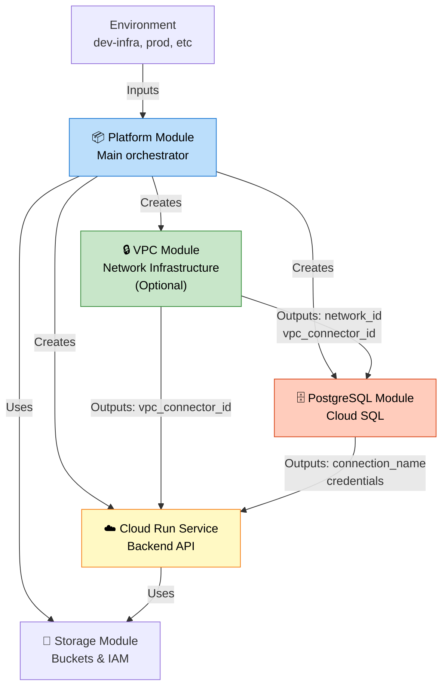
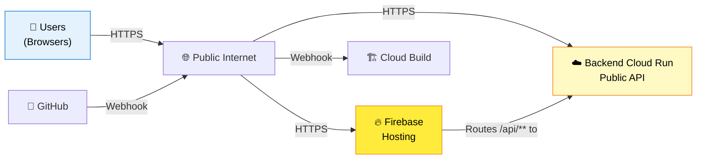
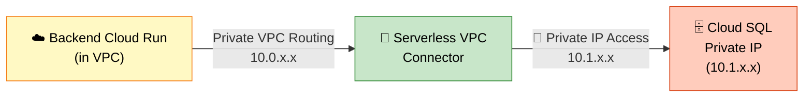
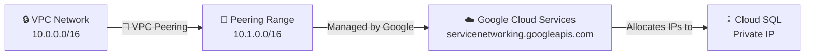
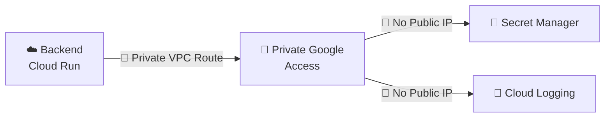

# Creative Studio Infrastructure Architecture

## 🚀 Quick Start Guide

**⏱️ Total Setup Time: ~60-90 minutes (one-time)**

**👉 [START HERE: QUICK_START.md](./QUICK_START.md)** for step-by-step setup instructions.

This document provides detailed architecture information. For deployment instructions, see:
- **[QUICK_START.md](./QUICK_START.md)** - Complete setup walkthrough (10 steps, 60-90 minutes)
- **[README.md](./README.md)** - Detailed technical documentation and troubleshooting

### Deployment Phases Overview

**Phase 1 (Now - Implemented):**
- ✅ Manual: Create GCP Project, Firebase, Cloud Build connection
- ✅ Terraform: Deploy all infrastructure + Identity Platform configuration
- ⏳ Reference: [QUICK_START.md](./QUICK_START.md) Steps 1-8

**Phase 2 (Planned):**
- Terraform auto-creates Firebase Project & Web App
- Eliminates manual Firebase Console steps

**Phase 3 (Planned):**
- Terraform auto-creates OAuth credentials
- Complete infrastructure-as-code automation

---

## Overview

The Creative Studio infrastructure is built on Google Cloud Platform with a strategic separation of concerns:
- **Frontend**: Deployed as static files on Firebase Hosting (public, accessible to end users)
- **Backend**: Deployed on Cloud Run with optional VPC networking for secure database connectivity
- **Database**: Cloud SQL with configurable public/private IP access

This document provides detailed architecture diagrams and component descriptions.

---

## 1. Complete Infrastructure Overview



**Key Architecture Points:**
- ✅ Frontend runs on **Firebase Hosting** (static files, globally distributed)
- ✅ Backend runs on **Cloud Run** (serverless, auto-scaling)
- ✅ Users access frontend via public internet
- ✅ Frontend calls backend via **public HTTP/REST API**
- ✅ Backend connects to database via **VPC Connector** (when enabled)

---

## 2. Network Layer Architecture

### VPC Network Design (When Enabled)



**VPC Network Characteristics:**
- **VPC Name**: `cs-{environment}` (e.g., `cs-development`, `cs-production`)
- **Routing Mode**: REGIONAL
- **Auto-create subnets**: Disabled (manual control)
- **Private Google Access**: Enabled for Cloud services
- **Status**: Optional - can be disabled for simpler deployments

### Subnet Configuration

| Subnet | CIDR Range | Purpose | Features |
|--------|-----------|---------|----------|
| **Primary** | 10.0.0.0/24 | Cloud Run, Frontend Services | Private Google Access enabled |
| **Connector** | 10.0.1.0/28 | Serverless VPC Connector only | Dedicated to connector operations |
| **Private Service** | 10.1.0.0/16 | Google managed (Cloud SQL) | VPC peering range, auto-allocated |

---

## 3. Data Flow: User Request Journey



**Connection Types:**
- ✅ **EXTERNAL**: User ↔ Firebase (HTTPS, public internet)
- ✅ **EXTERNAL**: User ↔ Backend (HTTPS, public internet)
- 🔐 **INTERNAL**: Backend ↔ Secret Manager (private path, private IP)
- 🔒 **INTERNAL**: Backend ↔ VPC Connector (private IP)
- 🔒 **INTERNAL**: VPC Connector ↔ Cloud SQL (private IP)

---

## 4. Cloud Build Deployment Flow



**Deployment Process:**
1. Code push to GitHub triggers Cloud Build webhook
2. Cloud Build builds two separate artifacts:
   - **Backend**: Docker image → Artifact Registry → Cloud Run
   - **Frontend**: Angular build → Firebase Hosting
3. Backend Cloud Run service:
   - Gets VPC Connector attached (if vpc_enable=true)
   - Exposes public HTTPS endpoint
4. Frontend Firebase Hosting:
   - Serves static files globally via CDN
   - Rewrites `/api/**` requests to backend Cloud Run service
5. Users access frontend via Firebase Hosting URL
6. Frontend JavaScript calls backend via public API endpoint

---

## 5. Security Architecture



**Security Features:**
- ✅ **Frontend**: Static files on Firebase Hosting (no code execution)
- ✅ **Backend**: Public HTTPS API (accessible to frontend from browsers)
- ✅ **Cloud SQL**: Has **NO public IP** (private only)
- ✅ **VPC Connector**: Routes backend requests to Cloud SQL privately
- ✅ **Private Path**: Secret Manager via Google Cloud internal paths
- ✅ **Service Account**: Least privilege IAM roles per service
- ✅ **Firewall Rules**: Explicitly allow only necessary internal traffic
- ✅ **Separation**: Frontend and backend are independent services

**Key Security Principle:**
- Frontend is **public** (users download it to their browsers)
- Backend API is **public** (frontend calls it from browsers)
- Database is **private** (only reachable from backend via VPC)

---

## 6. Module Dependency Graph



**Module Responsibilities:**
- **Platform Module**: Orchestrates all infrastructure, **enables required Google Cloud APIs**, manages environment variables and cross-module permissions
- **VPC Module** (optional): Creates private network infrastructure (VPC, subnets, VPC Connector, firewall rules)
- **PostgreSQL Module**: Creates Cloud SQL instance (private IP when VPC enabled)
- **Backend Cloud Run**: Deploys backend API service (always public)
- **Storage Module**: Cloud Storage buckets and IAM permissions
- **Firebase Hosting Module**: Deploys frontend static files to Firebase

**Notes:**
- **Platform Module automatically enables all 15 required Google Cloud APIs** - no manual enablement needed
- VPC module is optional (vpc_enable=true/false)
- Cloud SQL uses private IP only when VPC is enabled
- Firebase Hosting is deployed separately (not via terraform), serves static files
- All modules have explicit dependency on API enablement to ensure services are available

---

## 7. Platform Module API Enablement

### Overview

The **Platform Module** automatically enables all required Google Cloud APIs during `terraform apply`. This ensures that all foundational services are available before any dependent resources are created.

### Enabled APIs

The platform module enables 15 essential Google Cloud APIs:

| API | Purpose | Required For |
|-----|---------|--------------|
| `aiplatform.googleapis.com` | Vertex AI services | AI/ML operations |
| `artifactregistry.googleapis.com` | Container/artifact storage | Storing Docker images |
| `cloudbuild.googleapis.com` | CI/CD pipeline | Building and deploying code |
| `cloudfunctions.googleapis.com` | Serverless functions | Optional function deployments |
| `cloudresourcemanager.googleapis.com` | Resource management | Project resource management |
| `compute.googleapis.com` | VPC and networking | VPC networks, subnets, firewall rules |
| `firestore.googleapis.com` | NoSQL database | Optional data storage |
| `iam.googleapis.com` | Identity and Access Management | Service account management |
| `iamcredentials.googleapis.com` | IAM credentials | Service account authentication |
| `run.googleapis.com` | Cloud Run | Backend service deployment |
| `serviceusage.googleapis.com` | Service management | Enabling other APIs |
| `servicenetworking.googleapis.com` | VPC peering | Cloud SQL private IP connections |
| `sqladmin.googleapis.com` | Cloud SQL management | PostgreSQL database |
| `texttospeech.googleapis.com` | Text-to-speech API | Optional audio generation |
| `vpcaccess.googleapis.com` | Serverless VPC Connector | Private backend-to-database connectivity |

### Implementation

```hcl
# In infra/modules/platform/main.tf

locals {
  required_apis = [
    "aiplatform.googleapis.com",
    "artifactregistry.googleapis.com",
    "cloudbuild.googleapis.com",
    # ... (all 15 APIs listed)
    "vpcaccess.googleapis.com",
  ]
}

resource "google_project_service" "apis" {
  for_each = toset(local.required_apis)

  project = var.gcp_project_id
  service = each.key

  # Prevent disabling APIs on terraform destroy
  disable_on_destroy = false
}
```

### Dependency Management

All modules have explicit dependencies on API enablement:

```hcl
# VPC Module
depends_on = [google_project_service.apis]

# PostgreSQL Module
depends_on = [
  google_project_service.apis,
  module.vpc_network,
]

# Backend Service (Cloud Run)
depends_on = [google_project_service.apis]

# Firebase Project
depends_on = [google_project_service.apis]

# Frontend Service
depends_on = [google_project_service.apis]
```

This ensures APIs are fully enabled before any services attempt to use them.

### Benefits

✅ **No Manual API Enablement** - Eliminates manual `gcloud services enable` commands
✅ **Guaranteed Availability** - Explicit dependencies ensure APIs are ready
✅ **Idempotent** - Safe to run multiple times
✅ **Persistent** - `disable_on_destroy = false` prevents accidental API disabling
✅ **Centralized** - All API configuration in one place (Platform Module)

---

## 8. VPC Module Deep Dive

### VPC Module Structure

```
modules/vpc_network/
├── variables.tf          # VPC configuration inputs
├── main.tf               # VPC network & service peering
├── subnets.tf            # Primary & connector subnets
├── connectors.tf         # Serverless VPC Connector
├── firewall.tf           # Network security rules
└── outputs.tf            # Module outputs
```

### Key Resources Created

| Resource | Name Pattern | Purpose |
|----------|--------------|---------|
| **VPC Network** | `cs-{env}` | Main VPC network |
| **Global Address** | `cs-{env}-private-ip-address` | VPC peering range (10.1.0.0/16) |
| **Service Connection** | Google managed | Private IP allocation for Cloud SQL |
| **Primary Subnet** | `cs-{env}-primary` | Cloud Run/services (10.0.0.0/24) |
| **Connector Subnet** | `cs-{env}-connector` | VPC Connector only (10.0.1.0/28) |
| **VPC Connector** | `cs-{env}-connector` | Serverless connector (2-3 instances) |
| **Firewall Rules** | `cs-{env}-allow-*` | Allow internal/Cloud SQL traffic |

---

## 9. Connection Types Reference

### ✅ EXTERNAL Connections (Public Internet)



**Characteristics:**
- ✅ Users access Firebase Hosting directly
- ✅ Firebase serves static files (HTML/CSS/JS)
- ✅ Frontend JavaScript calls backend API via public internet
- ✅ Backend Cloud Run has public HTTPS endpoint
- ✅ Rate limited by Google Cloud load balancers
- ✅ Accessible from anywhere with internet connection

### 🔒 INTERNAL Connections (VPC Private - Optional)



**Characteristics:**
- ✅ Backend → Database traffic stays within VPC (10.0.0.0/16)
- ✅ Uses private IP addresses (not accessible from internet)
- ✅ Protected by VPC firewall rules
- ✅ VPC Connector handles the translation
- ✅ Sub-millisecond latency
- ✅ More secure (database has no public IP)

### 🔄 PEERING Connections (Google Services)



**Characteristics:**
- VPC peering with Google-managed services
- Private IP range (10.1.0.0/16) reserved for Cloud SQL
- Managed automatically by Google Cloud
- No additional configuration needed

### 🔐 PRIVATE PATH Connections (Google APIs)



**Characteristics:**
- Uses VPC's Private Google Access feature
- Connects to Google APIs without public IP
- Subnet must have `private_ip_google_access = true`
- Enhanced security, no internet exposure

---

## 10. Terraform Configuration Reference

### Enable VPC for an Environment

```hcl
# In environments/prod_ops_sandbox/terraform.auto.tfvars

# Enable VPC networking
vpc_enable                  = true

# Disable public IP on Cloud SQL
cloud_sql_public_ip_enabled = false

# Configure subnet CIDR ranges
vpc_primary_subnet_cidr     = "10.0.0.0/24"
vpc_connector_subnet_cidr   = "10.0.1.0/28"
```

### Platform Module Integration

```hcl
# In modules/platform/main.tf

module "vpc_network" {
  count       = var.vpc_enable ? 1 : 0
  source      = "../vpc_network"

  project_id            = var.gcp_project_id
  region                = var.gcp_region
  name                  = "cs-${var.environment}"
  primary_subnet_cidr   = var.vpc_primary_subnet_cidr
  connector_subnet_cidr = var.vpc_connector_subnet_cidr
}

module "postgresql" {
  source = "../postgresql"

  # Pass VPC network to Cloud SQL
  vpc_network_id = var.vpc_enable ? module.vpc_network[0].network_id : null

  depends_on = [module.vpc_network]
}

module "backend_service" {
  count = var.enable_cloud_build ? 1 : 0
  source = "../cloud-run-service"

  # Pass VPC Connector to Backend Cloud Run
  vpc_connector_id = var.vpc_enable ? module.vpc_network[0].vpc_connector_id : null
}
```

---

## 11. Configuration Options

### Option A: Secure Production (VPC + Private IP)
**Recommended for production environments**

```hcl
vpc_enable                  = true
cloud_sql_public_ip_enabled = false
vpc_primary_subnet_cidr     = "10.0.0.0/24"
vpc_connector_subnet_cidr   = "10.0.1.0/28"
```

✅ Cloud SQL completely private
✅ All backend traffic routed through VPC
✅ No public IP exposure
✅ Google Cloud private paths for APIs

### Option B: Development (Public IP Only)
**Development/testing only**

```hcl
vpc_enable                  = false
cloud_sql_public_ip_enabled = true
```

⚠️ Cloud SQL publicly accessible
⚠️ Easier local testing but less secure
⚠️ NOT recommended for production

### Option C: Hybrid (Both VPC and Public)
**Testing VPC migration**

```hcl
vpc_enable                  = true
cloud_sql_public_ip_enabled = true
vpc_primary_subnet_cidr     = "10.0.0.0/24"
vpc_connector_subnet_cidr   = "10.0.1.0/28"
```

✅ Cloud Run uses private connection via VPC Connector
✅ Allows direct public access for testing tools
⚠️ Not recommended long-term

---

## 12. Deployment Checklist

### Pre-Deployment
- [ ] GCP Project created and configured
- [ ] Terraform service account with required IAM roles
- [ ] GCS bucket created for Terraform state
- [ ] GitHub repository connected to Cloud Build
- [ ] Firebase project created and authenticated

### VPC Configuration
- [ ] `vpc_enable = true` in terraform.auto.tfvars
- [ ] `cloud_sql_public_ip_enabled = false` in terraform.auto.tfvars
- [ ] Subnet CIDR ranges verified (no overlap with existing networks)
- [ ] VPC name follows pattern `cs-{environment}`

### Required APIs
**Automatically enabled by Platform Module** ✅
- ✅ `aiplatform.googleapis.com` (AI Platform)
- ✅ `artifactregistry.googleapis.com` (Artifact Registry)
- ✅ `cloudbuild.googleapis.com` (Cloud Build)
- ✅ `compute.googleapis.com` (VPC, networking)
- ✅ `iam.googleapis.com` (IAM management)
- ✅ `run.googleapis.com` (Cloud Run)
- ✅ `serviceusage.googleapis.com` (API management)
- ✅ `servicenetworking.googleapis.com` (Cloud SQL private IP)
- ✅ `sqladmin.googleapis.com` (Cloud SQL)
- ✅ `vpcaccess.googleapis.com` (Serverless VPC Connector)
- ✅ And 5 additional supporting APIs

**Note**: No manual API enablement needed - the platform module automatically enables all required APIs during `terraform apply`.

### Deployment
- [ ] Run `terraform init` from environment directory
- [ ] Run `terraform validate` and verify no errors
- [ ] Run `terraform plan` and review 31+ resources
- [ ] Run `terraform apply` to create infrastructure

### Post-Deployment
- [ ] Verify VPC network created: `gcloud compute networks list`
- [ ] Verify VPC Connector created: `gcloud compute vpc-access connectors list`
- [ ] Verify Cloud SQL private IP: `gcloud sql instances describe <instance-name>`
- [ ] Test Cloud Run ↔ Cloud SQL connectivity
- [ ] Review Cloud SQL connection string (private IP)

---

## 13. Monitoring & Troubleshooting

### VPC Health Checks

```bash
# List VPC networks
gcloud compute networks list

# Describe specific network
gcloud compute networks describe cs-development

# List subnets
gcloud compute networks subnets list --network cs-development

# List VPC Connectors
gcloud compute vpc-access connectors list --region us-central1

# Describe VPC Connector (shows instance count, state)
gcloud compute vpc-access connectors describe cs-development-connector --region us-central1
```

### Cloud SQL Verification

```bash
# List Cloud SQL instances
gcloud sql instances list

# Describe instance (shows IP configuration, VPC network)
gcloud sql instances describe creative-studio-db-<hash>

# Check private IP assignment
gcloud sql instances describe creative-studio-db-<hash> \
  --format="value(ipAddresses[0].ipAddress,ipAddresses[0].type)"

# Test connection from Cloud Run
gcloud cloud-shell ssh --command="psql -h <PRIVATE_IP> -U postgres -d creative_studio"
```

### Firewall Rules Verification

```bash
# List firewall rules for VPC
gcloud compute firewall-rules list --filter="network~^cs-" --format=table
```

### Common Issues

| Issue | Cause | Solution |
|-------|-------|----------|
| VPC not created | `vpc_enable = false` | Set to `true` in tfvars |
| Cloud SQL public IP still present | `cloud_sql_public_ip_enabled = true` | Set to `false` in tfvars |
| VPC Connector not attaching | `vpc_connector_id = null` | Verify `vpc_enable = true` |
| Backend can't reach Cloud SQL | Firewall rules not applied | Check firewall rules allow port 5432 |
| Connector subnet too small | Wrong CIDR range | Use at least /28 (14 usable IPs) |

---

## 14. Outputs Reference

### Module Outputs (Non-sensitive)

The platform module exposes the following outputs for reference (no secrets exposed):

```hcl
# VPC Network Information
vpc_network_id       = "projects/PROJECT_ID/global/networks/cs-development"
vpc_network_name     = "cs-development"
vpc_connector_id     = "projects/PROJECT_ID/locations/us-central1/connectors/cs-development-connector"
vpc_connector_name   = "cs-development-connector"

# Cloud SQL Information (no password exposed)
cloud_sql_connection_name = "PROJECT_ID:us-central1:creative-studio-db-XXXXX"
cloud_sql_instance_name   = "creative-studio-db-XXXXX"
cloud_sql_private_ip      = "10.1.x.x"  # Within peering range

# Cloud Run Services
backend_service_url  = "https://cstudio-backend-dev-XXXXX.run.app"
frontend_service_url = "https://cstudio-frontend-dev-XXXXX.run.app"

# Service Account Information
backend_service_account  = "cstudio-backend-dev@PROJECT_ID.iam.gserviceaccount.com"
frontend_service_account = "cstudio-frontend-dev@PROJECT_ID.iam.gserviceaccount.com"

# Secret Names (not values)
backend_secrets  = ["GOOGLE_TOKEN_AUDIENCE", ...]
frontend_secrets = ["FIREBASE_API_KEY", "FIREBASE_AUTH_DOMAIN", ...]
```

**Security Note:** All passwords, tokens, and credentials are stored in Secret Manager and never exposed through Terraform outputs.

---

## 15. VPC CIDR Planning

### Current Configuration

```
┌─────────────────────────────────────────────────┐
│           VPC Network: cs-{environment}         │
│                   10.0.0.0/16                   │
├─────────────────────────────────────────────────┤
│                                                 │
│  Primary Subnet: 10.0.0.0/24                   │
│  ├─ Hosts: 256 IPs (Cloud Run, Frontend)       │
│  ├─ Gateway: 10.0.0.1                          │
│  └─ Private Google Access: Enabled             │
│                                                 │
│  Connector Subnet: 10.0.1.0/28                 │
│  ├─ Hosts: 16 IPs (2-3 connector instances)    │
│  └─ Gateway: 10.0.1.1                          │
│                                                 │
├─────────────────────────────────────────────────┤
│      VPC Peering Range: 10.1.0.0/16            │
│  (Google-managed for Cloud SQL private IPs)     │
└─────────────────────────────────────────────────┘
```

### IP Allocation Summary

| Component | CIDR | IPs | Type |
|-----------|------|-----|------|
| Primary Subnet | 10.0.0.0/24 | 256 | Managed by Google |
| Connector Subnet | 10.0.1.0/28 | 16 | For VPC Connector |
| Peering Range | 10.1.0.0/16 | 65,536 | Cloud SQL only |
| **Total Usable** | 10.0.0.0/16 | ~65,000 | For future growth |

---

## 16. Data Residency & Compliance

### Data Flow Summary

| Data | Location | Encrypted | Access |
|------|----------|-----------|--------|
| User Session | Firebase (us-central1) | In transit (HTTPS) | Public |
| Frontend Code | Cloud Storage (us-central1) | At rest (AES-256) | Public |
| Backend Code | Cloud Run (us-central1) | At rest (AES-256) | Service Account |
| Application Data | Cloud SQL (us-central1) | At rest (AES-256) | Private VPC only |
| Credentials | Secret Manager | At rest (Google-managed) | Private path |
| Logs | Cloud Logging | At rest (AES-256) | Service Account |

### Compliance Notes

- ✅ All data encrypted at rest (AES-256)
- ✅ All network traffic encrypted in transit (TLS/HTTPS)
- ✅ No public IP on database layer
- ✅ Service-account based access control
- ✅ Audit logs via Cloud Audit Logs
- ✅ GDPR-compliant with proper data retention policies

---

## 17. Future Enhancements

Potential improvements to the current architecture:

1. **Multi-Region Setup**
   - Deploy VPC to multiple regions
   - Cloud SQL cross-region replication
   - Global load balancing

2. **Cloud NAT for Private Cloud Run**
   - If Cloud Run needs outbound internet access
   - Managed NAT gateway for private Cloud Run

3. **VPN/Interconnect**
   - Connect on-premises networks to VPC
   - Hybrid cloud setup

4. **Network Segmentation**
   - Additional subnets for different tiers
   - More granular firewall rules

5. **HA/Disaster Recovery**
   - Cloud SQL High Availability setup
   - Automated backups and failover

---

## 18. Quick Reference

### Terraform Commands

```bash
# Initialize Terraform (downloads providers)
cd environments/prod_ops_sandbox
terraform init

# Validate configuration
terraform validate

# Preview changes (31 resources)
terraform plan

# Deploy infrastructure
terraform apply

# View outputs
terraform output

# Destroy infrastructure (if needed)
terraform destroy
```

### Common Inspection Commands

```bash
# Verify VPC exists
gcloud compute networks describe cs-development

# Check Cloud SQL IP configuration
gcloud sql instances describe creative-studio-db-XXXXX \
  --format="value(ipAddresses[].[ipAddress,type])"

# Test VPC Connector status
gcloud compute vpc-access connectors describe cs-development-connector \
  --region us-central1

# View firewall rules
gcloud compute firewall-rules list --filter="network~^cs-"
```

---

## Document Information

- **Last Updated**: 2025-12-22
- **Infrastructure Version**: VPC + Private Cloud SQL
- **Terraform Version**: 1.13+
- **Google Cloud Provider**: hashicorp/google v5.0+
- **Status**: ✅ Ready for Deployment

